---
# ReactJS-course (v16.13)
---

# **Create React APP**

---

## Way 1

> Documentation [Github Official Documentation](https://github.com/facebook/create-react-app)

### Step 1

Create a app using the following command

```cmd
~$ npx create-react-app hello-world
```

> if The app deletes the project file immediately after the creating the app. Then try the below command out.

```cmd
~$ npm install -g create-react-app@latest   [if required]
```

### Step 2

Navigate terminal to the folder just created

```cmd
~$ cd hello-world
```

### Step 3

Start the npm

```cmd
~$ npm start
``
```

---

## Way 2

Globally

```cmd
npm install create-react-app -g
```

Create app

```cmd
~$ create-react-app <ProjectName>
```

---

### Way 1 is better and easier to handle

---

# **Folder Structure**

---

## `public` Folder

`node_modules/public/index.html` this file is very important

> In this file `<div id="root"></div>` is responsibe for UI of our app. React will handle this part of its own. We should not modify this `div`

## `src` Folder

This folder is using most during development

> `index.js` specify the root components which is app component and dom element which will be controll by react.

> `document.getElementById("root")`. Here `root` id is the id inside `public/index.html` which is `<div id="root"></div>`

> App componets represents view which we see in the browser.

> `App.css` for styling

> `App.test.js` file for unit test. Contains test cases.

> `index.css` which applied styles in body tag

> `logo.svg` reference in app component

> `serviceWorker.js` concern with progressive web app. For beginner this file is ignored.

---

# **BASIC REACT**

---

# **Components**

---

> Part of the UI

> Reusable and can be nested inside other components

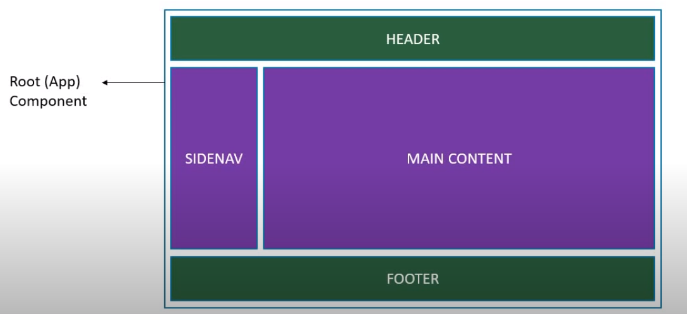

> Component codes write in `js` file. For example, `App` component has `App.js` file.

> Components have extension like `js` or `jsx` but in this tutorial I am focussing in just `.js`

## Component Types

2 Types

- Stateless Functional Component
- Statefull Class Component

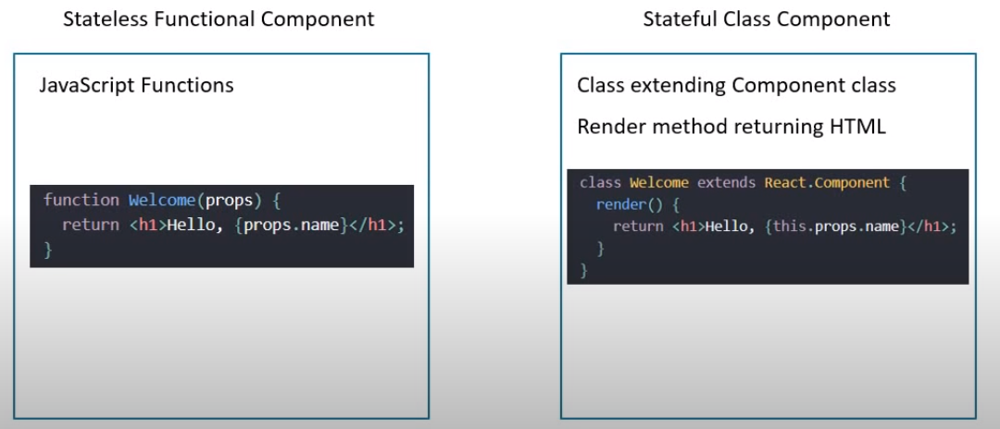

---

# **Functional Components**

---

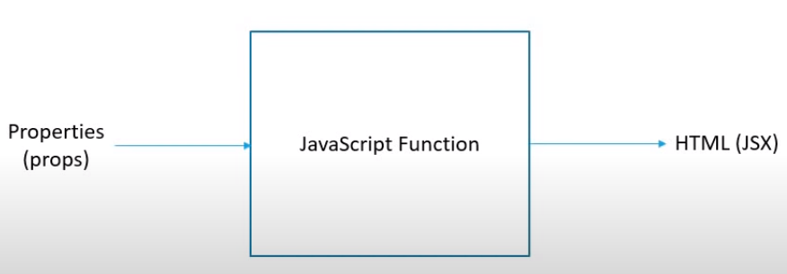

## Now create a very first functional component

> Create a folder `src/components`

> Create a file `src/components/Greet.js`

### Step 1

create a functional component

`Greet.js`

```js
import React from "react";

/*
function Greet() {
  return <h1>Hello Imrul</h1>;
}
*/

const Greet = () => <h1>Hello Imrul</h1>; //ES6 syntax

export default Greet;
```

> `Greet` function is exported to use outside.

### Step 2

`App.js`

```js
import React from "react";
import logo from "./logo.svg";
import "./App.css";
import MyGreet from "./components/Greet";

function App() {
  return (
    <div className="App">
      <MyGreet></MyGreet>
    </div>
  );
}
export default App;
```

> Here we import the component first using `import Greet from "./components/Greet";`

> Then we use our custom `<Greet></Greet>` tag which is pretty unique feature.

---

## Note:

> `export default Greet;` here `default` allows us to call with any name when `importing`

> in `App.js` we named it `MyGreet` as my own. But we have to specify the location of the file like `"./components/Greet";`

### Example

`Greet.js`

```js
import React from "react";
export const Greet = () => <h1>Hello Imrul</h1>;
```

`App.js`

```js
import { Greet } from "./components/Greet";
```

> Here we can we see we must import with exact same name in `Greet.js` file. We have to use `{}` to pass import it in that manner.

> We have no freedom to use our own name in other files.

> So this is the powet of using `default` when exporting.

---

# **Class Components**

---

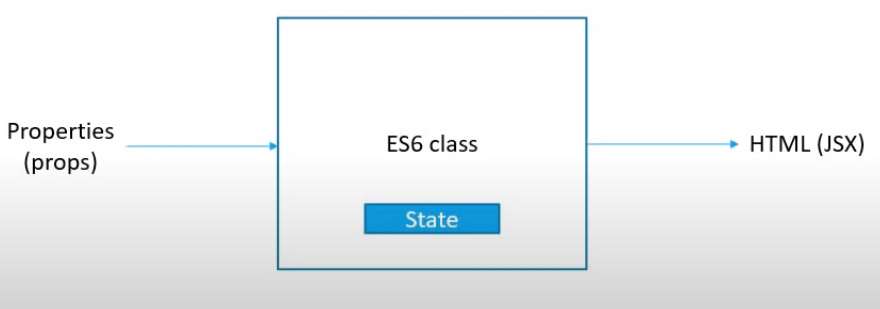

### Step 1

```js
import React, { Component } from "react";

class Welcome extends Component {
  render() {
    return <h1>Class Component</h1>;
  }
}

export default Welcome;
```

> In class component we need to specify two imports. one is `React`, other one is `{ Component }`.

> And the class should extends the `Component` class.

> Thirdly, we exported the class in `export default Welcome;` line.

### Step 2

```js
import React from "react";
import logo from "./logo.svg";
import "./App.css";
import MyGreet from "./components/Greet";
import Welcome from "./components/Welcome";

function App() {
  return (
    <div className="App">
      <MyGreet></MyGreet>
      <Welcome></Welcome>
    </div>
  );
}

export default App;
```

> Here we imported `import Welcome from "./components/Welcome";`

> And we heve our own `tag` which is `<Welcome></Welcome>`

---

## Advantage of Components

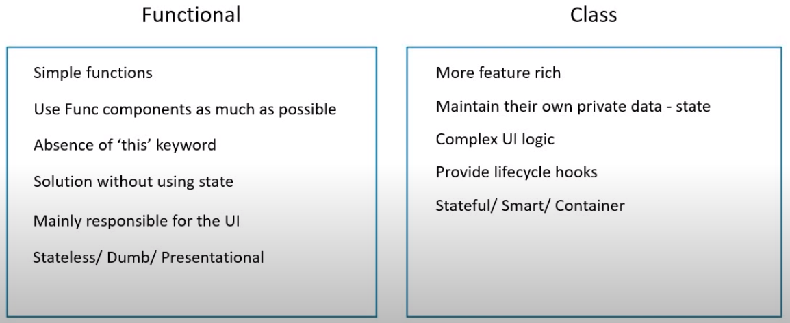

> So far we have learn about `App.js`, `Greet.js` and `Welcome.js`.

> We returns some html inside components. this is not regular `html`. It's known as `jsx`

---

# **Hooks Update**

---

> Documentation: [Hooks](https://reactjs.org/docs/hooks-intro.html)

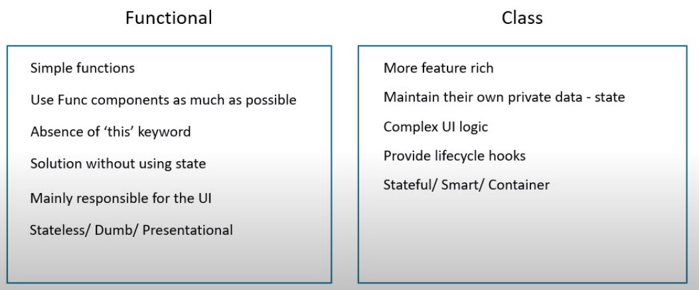

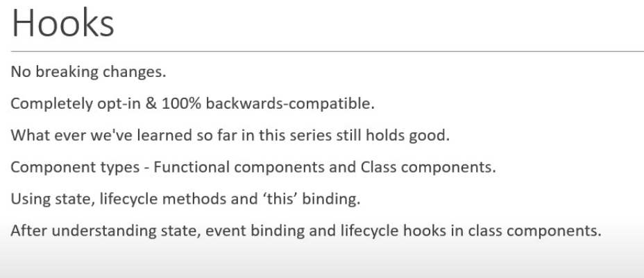

---

# **JSX (JavaScript XML)**

---

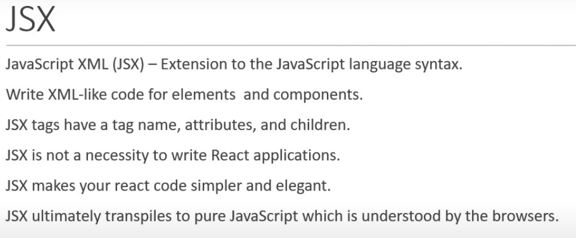

**Create components with JSX and without JSX.**

## component with JSX

Create a component named `components/JSX Version.js`

`components/JSX Version.js`

```js
import React from "react";

const JSX = () => {
  return (
    <div className="JSXclass">
      <h1>JSX Version: Hello Imrul!</h1>
    </div>
  );
};

export default JSX;
```

`App.js`

```js
import React from "react";
import logo from "./logo.svg";
import "./App.css";
import JSX from "./components/JSX Version";

function App() {
  return (
    <div className="App">
      <JSX></JSX>
    </div>
  );
}

export default App;
```

## component without JSX

`components/Not JSX Version.js`

```js
import React from "react";

const NotJSX = () => {
  return React.createElement("div", null, "NOT JSX Version");
};

export default NotJSX;
```

> `createElement` is built in method of `React`

> `(param1, param2, param3)` minimum 3 params.

> `param1` = String: html tag to be rendered.

> `param2` = optional property: `null` for now.

> `param3` = children of html: children for the `div` here.

`App.js`

```js
import React from "react";
import logo from "./logo.svg";
import "./App.css";
import NotJSX from "./components/Not JSX Version";

function App() {
  return (
    <div className="App">
      <NotJSX></NotJSX>
    </div>
  );
}

export default App;
```

> We use `className` instead of `class` because `class` is a reserved word in JS.

Fix the `<h1>` issues

`components/Not JSX.js`

```js
import React from "react";

const NotJSX = () => {
  return React.createElement(
    "div",
    { id: "notJSXid", class: "notJSXclass" },
    React.createElement("h1", null, "NOT JSX Version")
  );
};

export default NotJSX;
```

> Here 3rd parameter is another `createElement` method to specifiy `h1` tag.

> 2nd parameter specify an object. We pass a key `id` with value `notJSXid`

After inspecting

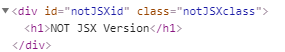

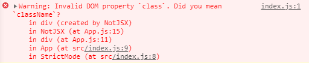

> Error for `class`. Because in `JavaScript` the `class` is a `reserved word`.

> Solution use `className` instead of `class` key.

```js
{ id: "notJSXid", className: "notJSXclass" },
```

> Now its allright.

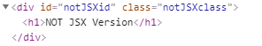

> We can see although we named the key as `className` the original file use `class` not `className`. It is handle by react.

> So in the end we have seen `JSX` is simpler than `without JSX`. Without JSX code become nasty. On the other hand with `JSX` the code will become cleaner and elegant.

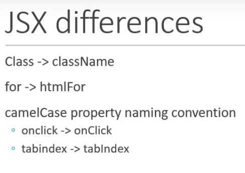

> To know what changes in react visit: [React Fire](https://www.youtube.com/redirect?stzid=UgznjOz4hQqekvtagrB4AaABAg&q=https%3A%2F%2Fgithub.com%2Ffacebook%2Freact%2Fissues%2F13525&event=comments&redir_token=QUFFLUhqbFAwWU1JRy1NTHpMV2Y1VmxiM05NTEZ5WWJsQXxBQ3Jtc0tucjRscEtHM1JaNXRHWDQ5R1p4LXVxcTNNaEhUemVNS1BZSlZISVcxQ0JYaHBXSEo4RGRVOF81MnI4RHd1V1RjQ1FoUkZVakJmR0pvc1NRdVZ2eXJWaFFPZFE1dS1hLURoSHRBNzY0UE9zYU8xdFdpQQ%3D%3D)

---

# **Props** with Functional Components

---

We can reuse the same `component` as many times as we want. Suppose we can use `<MyGreet></MyGreet>` anywhere we want.

> Outputs `Functional Component : Imrul`

> Sometime we need to use different name in place of `Imrul`. In that case the `props` come out to solve.

> `props`: Property -> is an optional input that your component can accept.

> Allows the components dynamic.

- Our goal is to send name to the `MyGreet` component from `App` component. And render that name in the browser.

- To specify props for a component we specify them as `attributes`.

- To specify a name property we just add `name` attribute.

- `props` is just an object

---

### Step 1

`App.js`

```js
import React from "react";
import logo from "./logo.svg";
import "./App.css";
import MyGreet from "./components/Greet";

function App() {
  return (
    <div className="App">
      <MyGreet name="Imrul" heroName="Superman"></MyGreet>
      <MyGreet name="Towhid" heroName="Batman"></MyGreet>
      <MyGreet name="Hasan" heroName="Spiderman"></MyGreet>
    </div>
  );
}

export default App;
```

`Greet.js`

```js
import React from "react";

const Greet = (props) => {
  console.log(props);
  return (
    <h1>
      Functional Component : {props.name} : {props.heroName}
    </h1>
  );
};

export default Greet;
```

> Here `props` parameter is passed through function. This name `props` is for naming convention not researved word.

> `props.name` here `name` and `heroName` is id's defined in our custom tags in `App.js`

> And we need to `return` the context which we want to display dynamically.

Output


---

## We can pass children tag

`App.js`

```js
import React from "react";
import logo from "./logo.svg";
import "./App.css";
import MyGreet from "./components/Greet";

function App() {
  return (
    <div className="App">
      <MyGreet name="Imrul" heroName="Superman">
        <p>This is children props</p>
      </MyGreet>
    </div>
  );
}

export default App;
```

> Here we have an children tag which is `p` tag with a paragraph.

`Greet.js`

```js
import React from "react";

const Greet = (props) => {
  console.log(props);
  return (
    <div>
      <h1>
        Functional Component : {props.name} : {props.heroName}
      </h1>
      {props.children}
    </div>
  );
};

export default Greet;
```

> Here we return also `props.children` after the `h1` tag.

> **One important Limitation:** we can return just one `html` tag. So we can nor `return` `h1` tag followed by th the `children`.

> We we wrap up all elements with a `div` tag and just return it as a single html `tag`.

> **Note:** If the children is not passed by `App.js`, the `Greet.js` component will return just `h1` tag not without `props.children`

> Children can be `p` , `button` or anything.

---

# **Props** with Class Components

---

`App.js`

```js
import React from "react";
import logo from "./logo.svg";
import "./App.css";
import Welcome from "./components/Welcome";

function App() {
  return (
    <div className="App">
      <Welcome name="Imrul" heroName="Superman">
        <p>Childrens</p>
      </Welcome>
      <Welcome name="Towhid" heroName="Batman">
        <button>Action</button>
      </Welcome>
      <Welcome name="Hasan" heroName="Spiderman"></Welcome>
    </div>
  );
}

export default App;
```

> Similar things

`Welcome.js`

```js
import React, { Component } from "react";

class Welcome extends Component {
  render() {
    return (
      <div>
        <h1>
          Class Component: {this.props.name} : {this.props.heroName}
        </h1>
        {this.props.children}
      </div>
    );
  }
}

export default Welcome;
```

> Here we must use `this` keyword in order to use `props`.

> **Note:** Here `props` is reserved keyword and we must use exact same name. So its mandatory to use this name not convension.

> we must return just only one html `tag` that's why we wrap up our whole contents in `div` tag to return.

> `props` are **Immutable** meaning the value can't be changed. For example if we try to assign a value to `props.name=Imrul` before returning then it will shows `Type Error`. This is readonly property.

---

# **State**

---

## Props vs State

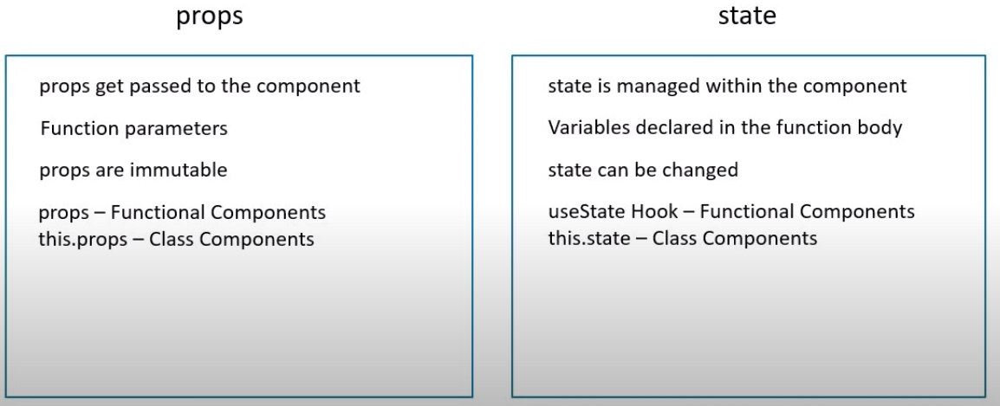

## Example of `state`

`components/message.js`

```js
import React, { Component } from "react";

class Message extends Component {
  constructor() {
    super();
    this.state = {
      message: "Welcome Visitor",
    };
  }

  changeMessage() {
    this.setState({
      message: "Thank you for subscribing",
    });
  }

  render() {
    return (
      <div>
        <h1>{this.state.message}</h1>
        <button onClick={() => this.changeMessage()}>Subscribe</button>
      </div>
    );
  }
}

export default Message;
```

> Firstly we create a `constructor()` above. This construct extends the charecteristics of `Component` class which is parent class actually using `super()`. And a `message` is set in `state`. As it is `class based` so we use `this` keywords.

> Secondly there is another function named `changeMessage()` in which we set the `message` to different text. To execute this function we need to call this `changeMessage()` function. Whereas `constructor` doesn't need to call to be executed.

> Thirdly in render function we return the `message` calling `this.state.message` inside `h1` tag. The message inside the `constructor` is initial state.

> Fourthly, when we click the `button` there is an `EventHandler` called `onClick`. And call the `changeMessage()` function. And withinn the `changeMessage()` function we the `message` is changed using `this.setState`. This is how we change the state.

`App.js`

```js
import React from "react";
import logo from "./logo.svg";
import "./App.css";
import Message from "./components/message";

function App() {
  return (
    <div className="App">
      <Message></Message>
    </div>
  );
}

export default App;
```

> In `App.js` everything is similar to before.

Output

### Initial State


### second State


---

# VS Code ES7 React/Redux/React-Native/JS snippets | Extension

---

### Shortcut for class component:

- type `rce`
- click on `tab` button

### Shorcut for constuctor in class component.

- type `rconst`
- click `tab`

---

# **setState** in class component

---

`App.js`

```js
import React from "react";
import logo from "./logo.svg";
import "./App.css";
import Count from "./components/counter";

function App() {
  return (
    <div className="App">
      <Count></Count>
    </div>
  );
}

export default App;
```

`counter.js`

```js
import React, { Component } from "react";

class counter extends Component {
  constructor(props) {
    super(props);
    this.state = {
      count: 0,
    };
  }

  increament() {
    // this.state.count = this.state.count + 1; //it should never be used
    this.setState({
      count: this.state.count + 1,
    });
    console.log(this.state.count);
  }

  render() {
    return (
      <div>
        <div>count - {this.state.count}</div>
        <button onClick={() => this.increament()}>Increament</button>
      </div>
    );
  }
}

export default counter;
```

> Never change state directly using `this.state.count = this.state.count + 1;`. Because it will change state in `console` but not in `UI`. React not rendering the state when it changes.

> **One Problem:**

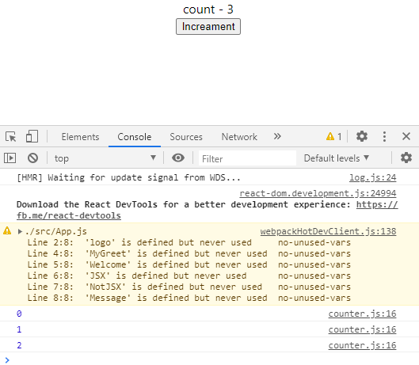

> Here we can see the `console value` = `rendered value` - `1`. Because calls to `setState` is `asynchronous`. console is called before the change of state. So console print less than 1 value.

> Sometime we might want to execute some codes only after the state is updated. We can handle such situation with a `callback` function as the second parameter of `setState` method.

> `setState(object, callback function)`

```js
increament() {
  this.setState(
  {
    count: this.state.count + 1,
  },
  () => {
    console.log("Callback value: ", this.state.count);
    }
  );
console.log(this.state.count);
}
```

> Here we can see the first parameter is an `object`. And the 2nd parameter is a `callback` function which we want to execute right after the `setState` method.

> **TIPS: ** Whenever you want to execute some code after `setState` method, don't put the code after `setState` method. Instead you pass the codes through a `callback` function.

---

## Complex

`counter.js`

```js
import React, { Component } from "react";

class counter extends Component {
  constructor(props) {
    super(props);
    this.state = {
      count: 0,
    };
  }

  increament() {
    this.setState(
      {
        count: this.state.count + 1,
      },
      () => {
        console.log("Callback value: ", this.state.count);
      }
    );
    console.log(this.state.count);
  }

  increamentFive() {
    this.increament();
    this.increament();
    this.increament();
    this.increament();
    this.increament();
  }

  render() {
    return (
      <div>
        <div>count - {this.state.count}</div>
        <button onClick={() => this.increament()}>Increament</button>
        <br></br>
        <button onClick={() => this.increamentFive()}>IncreamentFive</button>
      </div>
    );
  }
}

export default counter;
```

> Click on `IncreamentFIve` button

Results

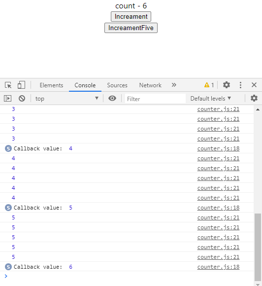

> We can see when we click on `IncreamentFive` it increaments just `1` instead of `5`. And we can also see that the `asynchronous` console prints each counter value 5 times with same value.

> Why is this?

> Because `react` may group multiple setState calls into a single update for better performance so what happens in our scenario is the five set state calls are done in one signel go and updated value doesn't carry over between the different calls.

### Solution

```js
increament() {
  this.setState(
    (prevState, props) => ({
      count: prevState.count + 1,
    }),
    () => {
      console.log("Callback value: ", this.state.count);
    }
  );
  console.log(this.state.count);
}
```

Outputs

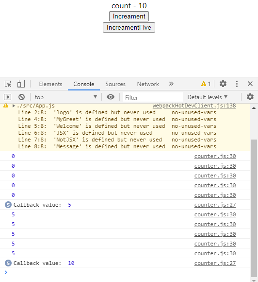

> **TIPS: ** Whenever you have to `update` the state based on the `previous state` make sure to pass a `function` as an argument instead of passing a regular `object`. Function has access to the previous state which can be used to calculate a new state. In that function first parameter is the `Prevstate` and the second parameter may be `props`. So we can also make use of `props` as well.

## Summary

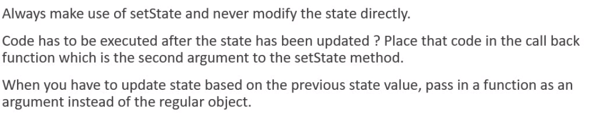

---

# **Destructuring props and state**

---

`App.js`

```js
import React from "react";
import logo from "./logo.svg";
import "./App.css";
import MyGreet from "./components/Greet";

function App() {
  return (
    <div className="App">
      <MyGreet name="Hasan" heroName="Spiderman"></MyGreet>
    </div>
  );
}

export default App;
```

## Way 1 [Destructuring with parameters]

`Greet.js`

```js
import React from "react";

const Greet = ({ name, heroName }) => {
  return (
    <div>
      <h1>
        Functional Component : {name} : {heroName}
      </h1>
    </div>
  );
};

export default Greet;
```

> Here we use `Greet = ({ name, heroName })` instead of `Greet = props`

## Way 2 [Destructuring in function body]

`Greet.js`

```js
import React from "react";

const Greet = (props) => {
  const { name, heroName } = props;
  return (
    <div>
      <h1>
        Functional Component : {name} : {heroName}
      </h1>
    </div>
  );
};

export default Greet;
```

## Way 3 : [Destructuring in Class Components]

`App.js`

```js
import React from "react";
import logo from "./logo.svg";
import "./App.css";
import Welcome from "./components/Welcome";

function App() {
  return (
    <div className="App">
      <Welcome name="Hasan" heroName="Spiderman"></Welcome>
    </div>
  );
}

export default App;
```

`Welcome.js`

```js
import React, { Component } from "react";

class Welcome extends Component {
  render() {
    const { name, heroName } = this.props;
    return (
      <div>
        <h1>
          Class Component: {name} : {heroName}
        </h1>
        {this.props.children}
      </div>
    );
  }
}

export default Welcome;
```

> `const { state1, state2 } = this.state;` If there need some states.

---

# **Event Handling**

---

- Mouse Click, Mouse Over, Key Press, Change Event etc

two rules

- React events are named as camel case rather than lower case
- Pass a function as the event handler rather than a string.

  - Instead of `onClick="clickHandler()"` use `onClick={clickHandler}`

- In Vanilla JS its possible to define a function withing another function.

## Funcional Components

`App.js`

```js
import React from "react";
import "./App.css";
import FunctionClick from "./components/FunctionClick";

function App() {
  return (
    <div className="App">
      <FunctionClick></FunctionClick>
    </div>
  );
}

export default App;
```

`FunctionClick.js`

```js
import React from "react";

function FunctionClick() {
  function clickHandler() {
    console.log("Button Clicked");
  }
  return (
    <div>
      <button onClick={clickHandler}>Click</button>
    </div>
  );
}

export default FunctionClick;
```

> Notice: We pass the function name on `onClick` without `()`

> pass function not function call.

## Class Compenents

`App.js`

```js
import React from "react";
import "./App.css";
import ClassClick from "./components/ClassClick";

function App() {
  return (
    <div className="App">
      <ClassClick></ClassClick>
    </div>
  );
}

export default App;
```

`ClassClick.js`

```js
import React, { Component } from "react";
class ClassClick extends Component {
  clickHandler() {
    console.log("Button Clicked");
  }
  render() {
    return (
      <div>
        <button onClick={this.clickHandler}>Click Me</button>
      </div>
    );
  }
}

export default ClassClick;
```

---

# **Binding Event Handlers**

---

Why Use it?

> because of the way this keyword works in JavaScript it is not because of how react works

## Class Components

`App.js`

```js
import React from "react";
import "./App.css";
import EventBind from "./components/EventBind";

function App() {
  return (
    <div className="App">
      <EventBind></EventBind>
    </div>
  );
}

export default App;
```

`EventBind.js`

```js
import React, { Component } from "react";

class EventBind extends Component {
  constructor(props) {
    super(props);

    this.state = {
      message: "Hello",
    };
  }

  clickHandler() {
    this.setState({
      message: "Goodbye",
    });
  }

  render() {
    return (
      <div>
        <div>{this.state.message}</div>
        <button onClick={this.clickHandler}>Click</button>
      </div>
    );
  }
}

export default EventBind;
```

### But there is an error!!!

> `TypeError: Cannot read property 'setState' of undefined`

> Because `this` keyword withing the event handler is `undefined`. That's why `event binding` is necessary in `react class component`

After Fixing

### Way 1 [use bind keyword and bind the handler]

`EventBind.js`

```js
<button onClick={this.clickHandler.bind(this)}>Click</button>
```

> How it works: Every update to the state will cause the component to rerender. This in turn will generate a brand new event handler on every render. Impact on performace is not severe in small applications. But it could be troublesome in large applications and components that contain nested children components.

### Way 2 [use arrow function s in the render method]

`EventHandler.js`

```js
<button onClick={() => this.clickHandler()}>Click</button>
```

### Way 3 [binding the Event Handler in Constructor] `[***]` [Official Approach]

`EventBind.js`

```js
import React, { Component } from "react";

class EventBind extends Component {
  constructor(props) {
    super(props);

    this.state = {
      message: "Hello",
    };

    this.clickHandler = this.clickHandler.bind(this);
  }

  clickHandler() {
    this.setState({
      message: "Goodbye",
    });
  }

  render() {
    return (
      <div>
        <div>{this.state.message}</div>
        <button onClick={this.clickHandler}>Click</button>
      </div>
    );
  }
}

export default EventBind;
```

### Way 4 [arrow function as a class property]

`EventBind.js`

```js
import React, { Component } from "react";

class EventBind extends Component {
  constructor(props) {
    super(props);

    this.state = {
      message: "Hello",
    };
  }

  clickHandler = () => {
    this.setState({
      message: "Goodbye",
    });
  };

  render() {
    return (
      <div>
        <div>{this.state.message}</div>
        <button onClick={this.clickHandler}>Click</button>
      </div>
    );
  }
}

export default EventBind;
```

---

# **Methods as props**

---

> We pass a reference to a method as props to the child component.

`App.js`

```js
import React from "react";
import logo from "./logo.svg";
import "./App.css";
import ParentComponent from "./components/ParentComponent";

function App() {
  return (
    <div className="App">
      <ParentComponent></ParentComponent>
    </div>
  );
}

export default App;
```

`ChildComponent.js`

```js
import React from "react";

function ChildComponent(props) {
  return (
    <div>
      <button onClick={props.greetHandler}>Greet Parent</button>
    </div>
  );
}

export default ChildComponent;
```

> When click on the `button` then fire the `greetHandler` in `ParentComponent` and the `greetHandler` is taken using `props`

`ParentComponent.js`

```js
import React, { Component } from "react";
import ChildComponent from "./ChildComponent";

class ParentComponent extends Component {
  constructor(props) {
    super(props);

    this.state = {
      parentName: "Parent",
    };

    this.greetParent = this.greetParent.bind(this);
  }

  greetParent() {
    // alert('Hello' + this.state.parentName)
    alert(`Hello ${this.state.parentName}`); //ES6 syntax
  }

  render() {
    return (
      <div>
        <ChildComponent greetHandler={this.greetParent}></ChildComponent>
      </div>
    );
  }
}

export default ParentComponent;
```

> `this.greetParent = this.greetParent.bind(this);` is need to bind in `constructor`

---

## pass parameter when calling the parent method from the child component.

- Array function syntax is the simplest way to pass parameters from the child compoent to the parent component.

`ChildComponent.js`

```js
import React from "react";

function ChildComponent(props) {
  return (
    <div>
      <button onClick={() => props.greetHandler("child")}>Greet Parent</button>
    </div>
  );
}

export default ChildComponent;
```

> react Snippet: **rfce** -> **tab**

> pass a string `child` to the parent `greetHandler`

`ParentComponent.js`

> Arrow function is used to pass parameters from child components to parent components.

```js
import React, { Component } from "react";
import ChildComponent from "./ChildComponent";

class ParentComponent extends Component {
  constructor(props) {
    super(props);

    this.state = {
      parentName: "Parent",
    };

    this.greetParent = this.greetParent.bind(this);
  }

  greetParent(childName) {
    alert(`Hello ${this.state.parentName} from ${childName}`);
  }

  render() {
    return (
      <div>
        <ChildComponent greetHandler={this.greetParent}></ChildComponent>
      </div>
    );
  }
}

export default ParentComponent;
```

> `greetHanlder` as a **props**

> Receive the `string` in parameter of `greetParent` function. And prints in alert function.

## Process Overview

Parent

- method is defined in `ParentComponent`

- on the Child Component tag pass the method as a `props`

Child

- In the child component access the method using the `props` object

- You have to pass a parameter use the array function systax.

By the way you can destructure the props object in the functional component but since we have this one prop I'm going to leave it as it is.

---

---

# **Conditional Rendering**

---

Approach

- if/else
- element variables
- ternamy conditional operator
- short circuit operator

`App.js`

```js
import React from "react";
// import logo from "./logo.svg";
import "./App.css";
import UserGreeting from "./components/UserGreeting";

function App() {
  return (
    <div className="App">
      <UserGreeting></UserGreeting>
    </div>
  );
}

export default App;
```

## If/Else Approach

`UserGreeting.js`

```js
import React, { Component } from "react";

class UserGreeting extends Component {
  constructor(props) {
    super(props);

    this.state = {
      isLoggedIn: false,
    };
  }

  render() {
    if (this.state.isLoggedIn) {
      return (
        <div>
          <div>Welcome Imrul!</div>
        </div>
      );
    } else {
      return (
        <div>
          <div>Welcome Guest!</div>
        </div>
      );
    }
  }
}

export default UserGreeting;
```

> We can not use condition inside `JSX` So we must use condtion outside of `JSX`

## Approach 2: Element Variables

`UserGreeting.js`

```js
import React, { Component } from "react";

class UserGreeting extends Component {
  constructor(props) {
    super(props);

    this.state = {
      isLoggedIn: false,
    };
  }

  render() {
    let message;
    if (this.state.isLoggedIn) {
      message = <div>Welcome Imrul!</div>;
    } else {
      message = <div>Welcome Guest!</div>;
    }

    return <div>{message}</div>;
  }
}

export default UserGreeting;
```

> Here `message` is a variable which is stores the element to be rendered.

## Approach 3: Ternamy Conditional Operator

`UserGreeting.js`

```js
import React, { Component } from "react";

class UserGreeting extends Component {
  constructor(props) {
    super(props);

    this.state = {
      isLoggedIn: false,
    };
  }

  render() {
    return this.state.isLoggedIn ? (
      <div>Welcome Imrul</div>
    ) : (
      <div>Welcome Guest</div>
    );
  }
}

export default UserGreeting;
```

> Benifit: can be used inside the JSX.

## Approach 4: Short Circuit Operator

`UserGreeting.js`

```js
import React, { Component } from "react";

class UserGreeting extends Component {
  constructor(props) {
    super(props);

    this.state = {
      isLoggedIn: true,
    };
  }

  render() {
    return this.state.isLoggedIn && <div>Welcome Imrul</div>;
  }
}

export default UserGreeting;
```

> if `this.state.isLoggedIn` is true then `<div>Welcome Imrul</div>` is also true. This it returns the statement.

> if `this.state.isLoggedIn` is false then no matter right side true or false the statement will always false. Hence return nothing.

---

> Finally Approach #3 and #4 is much more cleaner and readable.

---

---

# **List Rendering**

---

> The `map()` method creates a new array populated with the results of calling a provided function on every element in the calling array.

```js
const array1 = [1, 4, 9, 16];

// pass a function to map
const map1 = array1.map((x) => x * 2); // param => func body

console.log(map1);
// expected output: Array [2, 8, 18, 32]
```

---

`App.js`

```js
import React from "react";
// import logo from "./logo.svg";
import "./App.css";
import NameList from "./components/NameList";
function App() {
  return (
    <div className="App">
      <NameList></NameList>
    </div>
  );
}

export default App;
```

`NameList.js`

```js
import React from "react";

function NameList() {
  const names = ["imrul", "hasan", "brishty", "akter"];
  return (
    <div>
      <h2>{names[0]}</h2>
      <h2>{names[1]}</h2>
      <h2>{names[2]}</h2>
      <h2>{names[3]}</h2>
    </div>
  );
}

export default NameList;
```

> But this is not proper way of list rendering.

`NameList.js`

```js
import React from "react";

function NameList() {
  const names = ["Imrul", "Hasan", "UAP", "CSE"];
  return (
    <div>
      {names.map((name) => (
        <h2>{name}</h2>
      ))}
    </div>
  );
}

export default NameList;
```

### Example 1

`NameList.js`

```js
import React from "react";

function NameList() {
  const names = ["Imrul", "Hasan", "UAP", "CSE"];
  const NameList = names.map((name) => <h2>{name}</h2>);

  return <div>{NameList}</div>;
}

export default NameList;
```

### Example 2

`NameList.js`

```js
import React from "react";

function NameList() {
  const persons = [
    {
      id: 1,
      name: "Imrul",
      age: 24,
      skill: "Laravel",
    },
    {
      id: 2,
      name: "Hasan",
      age: 23,
      skill: "ReactJS",
    },
    {
      id: 3,
      name: "Imu",
      age: 25,
      skill: "JQuery",
    },
    {
      id: 4,
      name: "Backstreet",
      age: 20,
      skill: "Wordpress",
    },
    {
      id: 5,
      name: "Boys",
      age: 21,
      skill: "JavaScript",
    },
  ];

  const PersonList = persons.map((person) => (
    <h2 key={person.id}>
      I am {person.name}. I am {person.age} years old. I know {person.skill}{" "}
      very well.
    </h2>
  ));

  return <div>{PersonList}</div>;
}

export default NameList;
```

> Here we I use `key={person.id}` inside the `h2` tag as it recommanded to use.

> Everything works fine. But needs to be refactored.

### Formated Way

`NameList.js`

```js
import React from "react";
import Person from "./Person";

function NameList() {
  const persons = [
    {
      id: 1,
      name: "Imrul",
      age: 24,
      skill: "Laravel",
    },
    {
      id: 2,
      name: "Hasan",
      age: 23,
      skill: "ReactJS",
    },
    {
      id: 3,
      name: "Imu",
      age: 25,
      skill: "JQuery",
    },
    {
      id: 4,
      name: "Backstreet",
      age: 20,
      skill: "Wordpress",
    },
    {
      id: 5,
      name: "Boys",
      age: 21,
      skill: "JavaScript",
    },
  ];

  const PersonList = persons.map((person) => (
    <Person key={person.id} person={person}></Person>
  ));

  return <div>{PersonList}</div>;
}

export default NameList;
```

> Here `key` props is not accessable in child component, here in `Person`. So we can not pass key as props in `Person` Compoent.

> Here inside `<Person> </Person>` we pass the `person` as a props as `person` in the file.

`Person.js`

```js
import React from "react";

function Person({ person }) {
  return (
    <div>
      <h2>
        I am {person.name}. I am {person.age} years old. I know {person.skill}
        very well.
      </h2>
    </div>
  );
}

export default Person;
```

> Here I get the person as props and use it inside the `h2` tag.

---

> Why `key` props is Important?

- Becuase it handles UI updates efficiently.

## List And Keys

- A key is a special string attribue you need to include when creating list of elements
- Keys gives the element a stable identity
- Keys help react identify which items have changed, are added, or removed
- Helps in efficient update of the user interface

---

# **Index as Key Anti-pattern**

---

`NameList.js`

```js
import React from "react";
import Person from "./Person";

function NameList() {
  const names = ["Imrul", "Hasan", "UAP", "CSE"];
  const NameList = names.map((name) => <h2 key={name}>{name}</h2>);

  return <div> {NameList}</div>;
}

export default NameList;
```

> Here `key={name}` inside `h2` so that the console error gone.

> **Note:** There will be no error until every element of `names` are unique. If there are duplicate same value then a new error occurs as `key` here violates the rules of uniqueness.

> If below `names` is used? Here `"Imrul"` used twich.

```js
const names = ["Imrul", "Hasan", "UAP", "CSE", "Imrul"];
```

> Warning: `Warning: Encountered two children with the same key, `Imrul`. Keys should be unique so that components maintain their identity across updates. Non-unique keys may cause children to be duplicated and/or omitted — the behavior is unsupported and could change in a future version.

## Solution?

`NameList.js`

```js
import React from "react";
import Person from "./Person";

function NameList() {
  const names = ["Imrul", "Hasan", "UAP", "CSE", "Imrul"];
  const NameList = names.map((name, index) => (
    <h2 key={index}>
      {index} : {name}
    </h2>
  ));

  return <div> {NameList}</div>;
}

export default NameList;
```

> Here `index` number passed as a `props` in second parameter with `name`. And use this `index` as key

- Index as key will cause some SERIOUS UI issues in certain scenarios and to demonastrat these scenarios there is an example

- LINKS [LINKS](https://codepen.io/gopinav/pen/gQpepq)

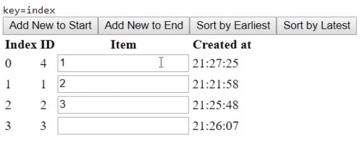

> Here we can see when we insert for a new item to the first. then index/id/timestamps works as we expected. But the empty row in the end. It should be in first. Its a major problem. So we should not use `index` as `key`.

> How react interpret this???? [below]

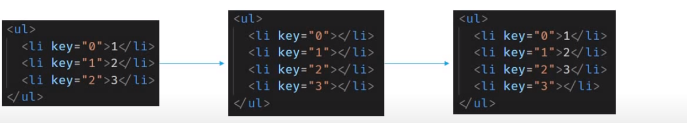

## Why?

- Because react thinks that it have already 3 values of `id = 1/2/3`. SO React reuse them and put a empty box for new id=4.

## Sorting Problem

- When we try to sort the elements `id`, `index` and `timestamps` will be changed. But the `item` value will as it was.

## So when to use `Index` is `Key`?

- The item in your list do not have a unique `ID`
- The list is static list and will not change.
- The list will never reordered or filterd.

---

# **Styling and CSS Basics**

---

## Few Options of Styling

1. Regular CSS Stylesheet
2. Inline Styling
3. CSS Module
4. CSS in JS Libraries (Styled Components)

## Aproach 1: Regular CSS Stylesheet

### Step 1: Creating Stylesheet

> Create `Stylesheet.js` inside component folder
> `rfce` tab to create functional Component in `Stylesheet.js`

### Step 2: Add the `Component` in `App.js`

> Add `<Stylesheet></Stylesheet>` in `App.js` and import in top

### Step 4: To Specify the CSS for this compoent

- Create a new file named `myStyles.css`

- add some CSS rules

### Step 5: import the `CSS` file in the target file

- import `myStyle.css` in `Stylesheet.js`
- and add `className="property"` in any tag to view the applied CSS rules

---

`App.js`

```js
import React from "react";
import "./App.css";
import Stylesheet from "./components/Stylesheet";

function App() {
  return (
    <div className="App">
      <Stylesheet></Stylesheet>
    </div>
  );
}

export default App;
```

`Stylesheet.js`

```js
import React from "react";
import "./myStyles.css";

function Stylesheet() {
  return (
    <div>
      <h1 className="primary">Stylesheet</h1>
    </div>
  );
}

export default Stylesheet;
```

`myStyles.css`

```css
.primary {
  color: orange;
}
```

> This will display the Text inside `h1` tag in orange color.

> if I want to display in a certain condition....

`App.js`

```js
import React from "react";
import "./App.css";
import Stylesheet from "./components/Stylesheet";

function App() {
  return (
    <div className="App">
      <Stylesheet primary={false}></Stylesheet>
    </div>
  );
}

export default App;
```

`Stylesheet.js`

```js
import React from "react";
import "./myStyles.css";

function Stylesheet(props) {
  let className = props.primary ? "primary" : "";
  return (
    <div>
      <h1 className={className}>Stylesheet</h1>
    </div>
  );
}

export default Stylesheet;
```

> Here `props` will take the values of `primary` passed from `App.js`

> if primary is `true` then this conditional statement will set value of `className` variable to `primary` else `''`

## If You Want To Specify Multiple Classes

- Simplest Option is to use `Template Literals` using `backticks`

`Stylesheet.js`

```js
import React from "react";
import "./myStyles.css";

function Stylesheet(props) {
  let className = props.primary ? "primary" : "";
  return (
    <div>
      <h1 className={`${className} font-xl`}>Stylesheet</h1>
    </div>
  );
}

export default Stylesheet;
```

> Here we can see multple class attrubute is passed in `className` inside `h1` tag.

## Approach 2: Inline Styling

- In react `inline css` are not specified as `string` instead they are specified as `object` whose key is the camel case version of the style name and the value is usually a string.

`App.js`

```js
import React from "react";
import "./App.css";
import Inline from "./components/Inline";

function App() {
  return (
    <div className="App">
      <Inline></Inline>
    </div>
  );
}

export default App;
```

`Inline.js`

```js
import React from "react";

const heading = {
  fontSize: "72px",
  color: "blue",
};

function inline() {
  return (
    <div>
      <h1 style={heading}>Inline CSS</h1>
    </div>
  );
}

export default inline;
```

> **Notice:** For inline we use the attribute `style`

## Approach 3: CSS Module

- Make use have `"react-scripts": "3.4.1"` in `package.json`

## Step 1: Create css file

- Create `appStyles.css` css style stylesheet in `src` folder.

## Step 2: Create CSS Module Stylesheet

- Create `appStyles.module.css` in `src` folder

`AppStyles.css`

```css
.error {
  color: red;
}
```

`appStyles.module.css`

```css
.success {
  color: green;
}
```

```App.js`

```js
import React from "react";
import "./App.css";

import "./appStyles.css";
import styles from "./appStyles.module.css";

function App() {
  return (
    <div className="App">
      <h1 className="error">Error</h1>
      <h1 className={styles.success}>Success</h1>
    </div>
  );
}

export default App;
```

> Here we can see `regular css` and `module css` imported in different way

> We can also look that both are called inside `className` attribute differently.

### Advantages of Module CSS:

- Classes are locally scoped by default.

> regular css `class` is same in all the files whereas the `modules css` class is scoped in the file only Because the file is imported as a variable.

---

---

# **Basic Of Form Handing**

---

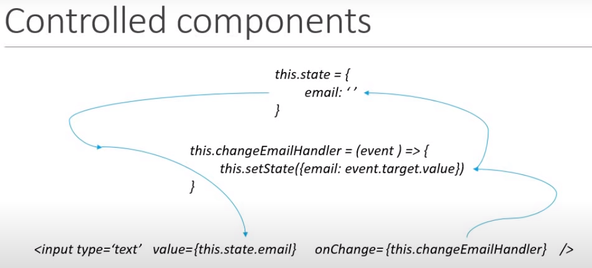

`App.js`

```js
import React from "react";
import "./App.css";
import Form from "./components/Form";

function App() {
  return (
    <div className="App">
      <Form></Form>
    </div>
  );
}

export default App;
```

## Using Regular Form

`Form.js`

```js
import React, { Component } from "react";

class Form extends Component {
  render() {
    return (
      <form>
        <div>
          <label>Username</label>
          <input type="text" />
        </div>
      </form>
    );
  }
}

export default Form;
```

> This form is in regular form style.

## Form Using Controlled React Component

Two Steps:

1. create a component state that will controll the input element.
   Assign the state property as the value of the input element
2. And then set `onChange` event handler to change the state.

`Form.js`

```js
import React, { Component } from "react";

class Form extends Component {
  constructor(props) {
    super(props);

    this.state = {
      username: "",
    };
  }

  render() {
    return (
      <form>
        <div>
          <label>Username</label>
          <input type="text" value={this.state.username} />
        </div>
      </form>
    );
  }
}

export default Form;
```

> But here We can see in the browser. No matter what we typing. The input fill is remains null. this is because the username is set to `null`. But we didn't change `onChange`

## Solution

`Form.js`

```js
import React, { Component } from "react";

class Form extends Component {
  constructor(props) {
    super(props);

    this.state = {
      username: "",
    };
  }

  handleUsernameChange = (event) => {
    this.setState({
      username: event.target.value,
    });
  };

  render() {
    return (
      <form>
        <div>
          <label>Username</label>
          <input
            type="text"
            value={this.state.username}
            onChange={this.handleUsernameChange}
          />
        </div>
      </form>
    );
  }
}

export default Form;
```

> Whenever a change in input field. Then the typed value is returned using `event.target.value`. So when `onChange` event, the event will take the value which we are typing in the input field.

---

## Select Input in Form

`Form.js`

```js
import React, { Component } from "react";

class Form extends Component {
  constructor(props) {
    super(props);

    this.state = {
      username: "",
      comments: "",
      topic: "react",
    };
  }

  handleUsernameChange = (event) => {
    this.setState({
      username: event.target.value,
    });
  };

  handleCommentsChange = (event) => {
    this.setState({
      comments: event.target.value,
    });
  };

  handleTopicChange = (event) => {
    this.setState({
      topic: event.target.value,
    });
  };

  render() {
    return (
      <form>
        <div>
          <label>Username</label>
          <input
            type="text"
            value={this.state.username}
            onChange={this.handleUsernameChange}
          />
        </div>
        <div>
          <label>Comments</label>
          <textarea
            type="text"
            value={this.state.comments}
            onChange={this.handleCommentsChange}
          ></textarea>
        </div>
        <div>
          <label>Topic</label>
          <select value={this.state.topic} onChange={this.handleTopicChange}>
            <option value="react">React</option>
            <option value="angular">Angular</option>
            <option value="vue">Vue</option>
          </select>
        </div>
        <button type="submit">Submit</button>
      </form>
    );
  }
}

export default Form;
```

> Here the submit button function as default submit button which is to refresh a new pages.

> Now we use the javascript functions to handle the submission of the form and the method.

- add `onSubmit={this.handleSubmit}` inside the forms openeing tag

`Form.js`

```js
import React, { Component } from "react";

class Form extends Component {
  constructor(props) {
    super(props);

    this.state = {
      username: "",
      comments: "",
      topic: "react",
    };
  }

  handleUsernameChange = (event) => {
    this.setState({
      username: event.target.value,
    });
  };

  handleCommentsChange = (event) => {
    this.setState({
      comments: event.target.value,
    });
  };

  handleTopicChange = (event) => {
    this.setState({
      topic: event.target.value,
    });
  };

  handleSubmit = (event) => {
    alert(`${this.state.username} ${this.state.comments} ${this.state.topic}`);
  };

  render() {
    return (
      <form onSubmit={this.handleSubmit}>
        <div>
          <label>Username</label>
          <input
            type="text"
            value={this.state.username}
            onChange={this.handleUsernameChange}
          />
        </div>
        <div>
          <label>Comments</label>
          <textarea
            type="text"
            value={this.state.comments}
            onChange={this.handleCommentsChange}
          ></textarea>
        </div>
        <div>
          <label>Topic</label>
          <select value={this.state.topic} onChange={this.handleTopicChange}>
            <option value="react">React</option>
            <option value="angular">Angular</option>
            <option value="vue">Vue</option>
          </select>
        </div>
        <button type="submit">Submit</button>
      </form>
    );
  }
}

export default Form;
```

> Now when we submit the form we can see the alert in the browser.

> But when we click on `ok` on alert modal then the page refreshes and the inputed data lost. But we want the data should be remain as it is.

- Solution?
  > We need an `event.preventDefault();` after the `alert` function.
  > This will prevent the default behavour of the form submission.

`Form.js`

```js
import React, { Component } from "react";

class Form extends Component {
  constructor(props) {
    super(props);

    this.state = {
      username: "",
      comments: "",
      topic: "react",
    };
  }

  handleUsernameChange = (event) => {
    this.setState({
      username: event.target.value,
    });
  };

  handleCommentsChange = (event) => {
    this.setState({
      comments: event.target.value,
    });
  };

  handleTopicChange = (event) => {
    this.setState({
      topic: event.target.value,
    });
  };

  handleSubmit = (event) => {
    alert(`${this.state.username} ${this.state.comments} ${this.state.topic}`);
    event.preventDefault();
  };

  render() {
    return (
      <form onSubmit={this.handleSubmit}>
        <div>
          <label>Username</label>
          <input
            type="text"
            value={this.state.username}
            onChange={this.handleUsernameChange}
          />
        </div>
        <div>
          <label>Comments</label>
          <textarea
            type="text"
            value={this.state.comments}
            onChange={this.handleCommentsChange}
          ></textarea>
        </div>
        <div>
          <label>Topic</label>
          <select value={this.state.topic} onChange={this.handleTopicChange}>
            <option value="react">React</option>
            <option value="angular">Angular</option>
            <option value="vue">Vue</option>
          </select>
        </div>
        <button type="submit">Submit</button>
      </form>
    );
  }
}

export default Form;
```

---

## Destructuring the props

`Form.js`

```js
import React, { Component } from "react";

class Form extends Component {
  constructor(props) {
    super(props);

    this.state = {
      username: "",
      comments: "",
      topic: "react",
    };
  }

  handleUsernameChange = (event) => {
    this.setState({
      username: event.target.value,
    });
  };

  handleCommentsChange = (event) => {
    this.setState({
      comments: event.target.value,
    });
  };

  handleTopicChange = (event) => {
    this.setState({
      topic: event.target.value,
    });
  };

  handleSubmit = (event) => {
    alert(`${this.state.username} ${this.state.comments} ${this.state.topic}`);
    event.preventDefault();
  };

  render() {
    const { username, comments, topic } = this.state;
    return (
      <form onSubmit={this.handleSubmit}>
        <div>
          <label>Username</label>
          <input
            type="text"
            value={username}
            onChange={this.handleUsernameChange}
          />
        </div>
        <div>
          <label>Comments</label>
          <textarea
            type="text"
            value={comments}
            onChange={this.handleCommentsChange}
          ></textarea>
        </div>
        <div>
          <label>Topic</label>
          <select value={topic} onChange={this.handleTopicChange}>
            <option value="react">React</option>
            <option value="angular">Angular</option>
            <option value="vue">Vue</option>
          </select>
        </div>
        <button type="submit">Submit</button>
      </form>
    );
  }
}

export default Form;
```

> Here we assing `const { username, comments, topic } = this.state;` to destructure. and Now no need to use `value={this.state.username}` instead use `{username}`

---

# **Component Life Cycle Method**

---

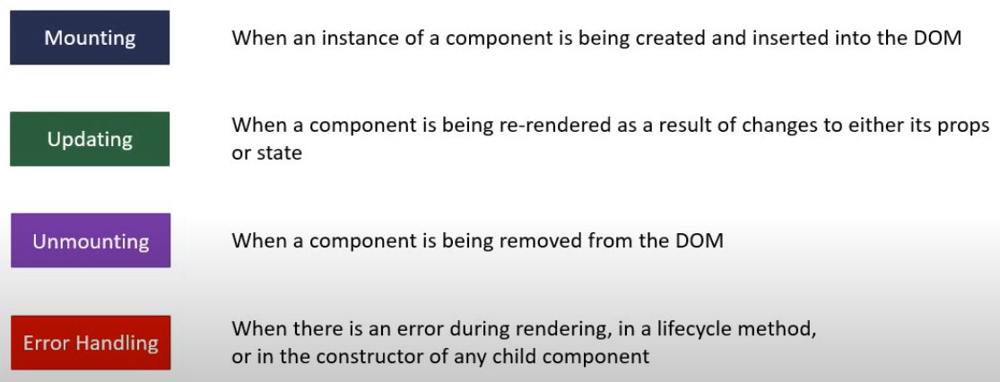

---

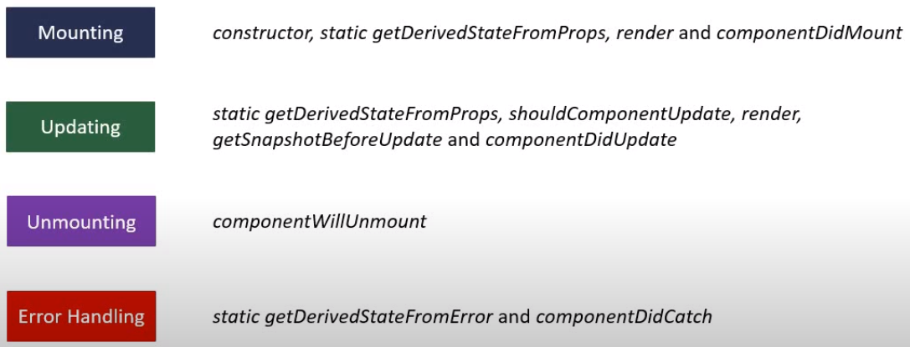

---

# **Mounting Life Cycle Method**

---

## First Method

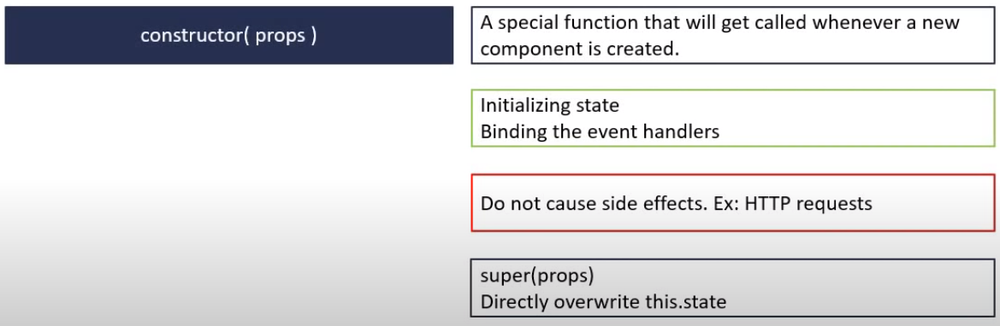

## 2nd Method

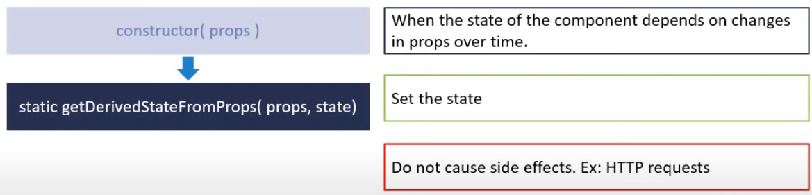

> As it is static method. It doensn't use `this` keyword inside this.

## 3rd Method

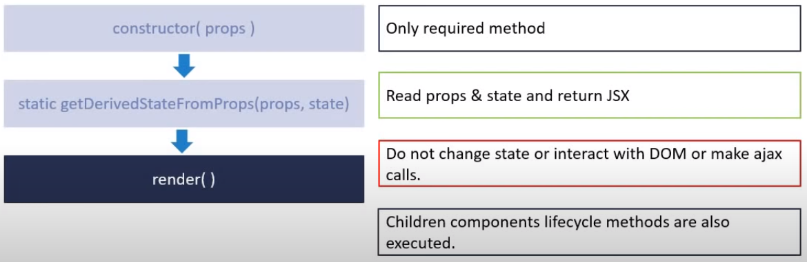

## 4th Method

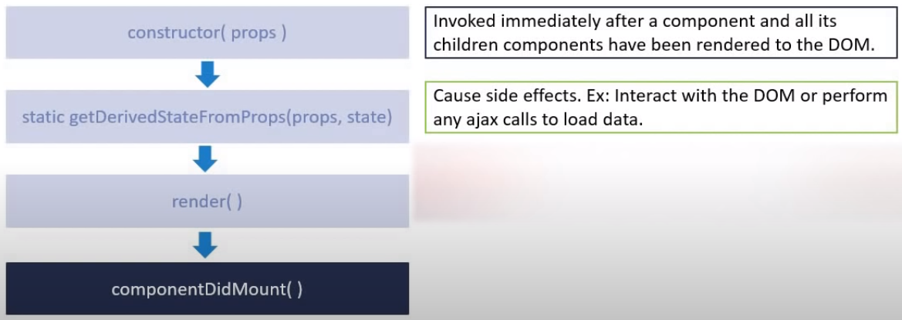

---

`App.js`

```js
import React from "react";
import "./App.css";
import LifecycleA from "./components/LifecycleA";

function App() {
  return (
    <div className="App">
      <LifecycleA />
    </div>
  );
}

export default App;
```

`LifecycleA.js`

```js
import React, { Component } from "react";

class LifecycleA extends Component {
  //first method
  constructor(props) {
    super(props);

    this.state = {
      name: "Imrul",
    };
    console.log("LifeCycleA Constructor");
  }

  //2nd method
  static getDerivedStateFromProps(props, state) {
    console.log("LifeCycleA getDerivedStateFromProps");
    return null;
  }

  //4th method
  componentDidMount() {
    console.log("LifeCycleA componentDidMount");
  }

  //3rd method
  render() {
    console.log("LifeCycleA render");
    return <div>Lifecycle A</div>;
  }
}

export default LifecycleA;
```

## Output:

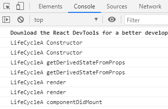

---

> What if the compoent have a child component ?

`App.js`

```js
import React from "react";
import "./App.css";
import LifecycleA from "./components/LifecycleA";

function App() {
  return (
    <div className="App">
      <LifecycleA />
    </div>
  );
}

export default App;
```

`LifecycleB.js`

```js
import React, { Component } from "react";

class LifecycleB extends Component {
  //first method
  constructor(props) {
    super(props);

    this.state = {
      name: "Imrul",
    };
    console.log("LifeCycleB Constructor");
  }

  //2nd method
  static getDerivedStateFromProps(props, state) {
    console.log("LifeCycleB getDerivedStateFromProps");
    return null;
  }

  //4th method
  componentDidMount() {
    console.log("LifeCycleB componentDidMount");
  }

  //3rd method
  render() {
    console.log("LifeCycleB render");
    return <div>Lifecycle B</div>;
  }
}

export default LifecycleB;
```

> Here `LifecycleB` is the child component.

`LifecycleA.js`

```js
import React, { Component } from "react";
import LifecycleB from "./LifecycleB";

class LifecycleA extends Component {
  //first method
  constructor(props) {
    super(props);

    this.state = {
      name: "Imrul",
    };
    console.log("LifeCycleA Constructor");
  }

  //2nd method
  static getDerivedStateFromProps(props, state) {
    console.log("LifeCycleA getDerivedStateFromProps");
    return null;
  }

  //4th method
  componentDidMount() {
    console.log("LifeCycleA componentDidMount");
  }

  //3rd method
  render() {
    console.log("LifeCycleA render");
    return (
      <div>
        <div>Lifecycle A</div>
        <LifecycleB />
      </div>
    );
  }
}

export default LifecycleA;
```

> Here `LifecycleA` is the parent component.

> And the child component is added in `render` function.

## Output:

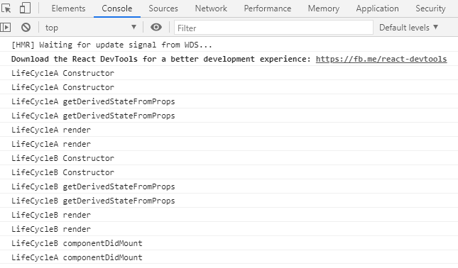

> Here we can see the order of execution.

---

# **Component Updating Lifecycle Methods**

---

## Method 1

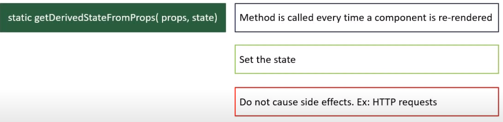

## Method 2


## Method 3

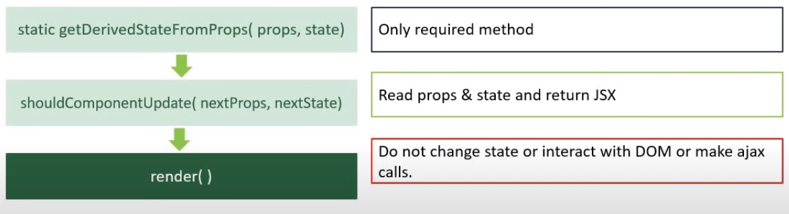

## Method 4

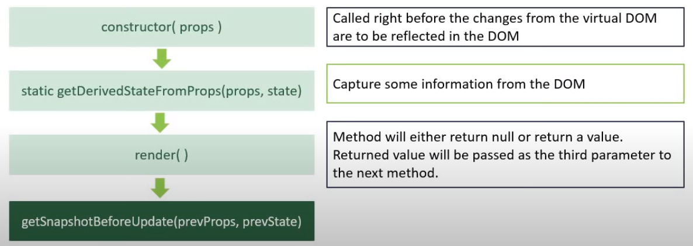

## Method 5

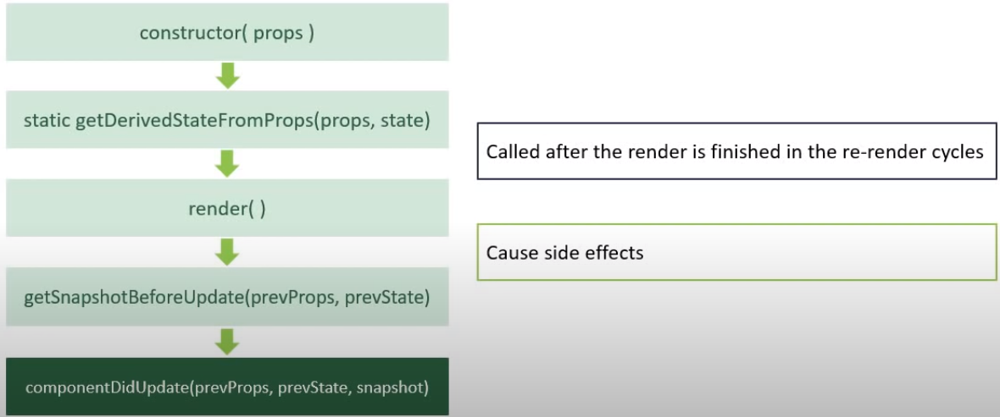

---

## Now example

`App.js`

```js
import React from "react";
import "./App.css";
import LifecycleA from "./components/LifecycleA";

function App() {
  return (
    <div className="App">
      <LifecycleA />
    </div>
  );
}

export default App;
```

`LifecycleA.js`

```js
import React, { Component } from "react";
import LifecycleB from "./LifecycleB";

class LifecycleA extends Component {
  //first method
  constructor(props) {
    super(props);

    this.state = {
      name: "Laravel",
    };
    console.log("LifeCycleA Constructor");
  }

  //2nd method_________+________ Update --#1
  static getDerivedStateFromProps(props, state) {
    console.log("LifeCycleA getDerivedStateFromProps");
    return null;
  }

  //4th method
  componentDidMount() {
    console.log("LifeCycleA componentDidMount");
  }

  //________________ Update -- #2
  shouldComponentUpdate() {
    console.log("LifeCycleA shouldComponentUpdate");
    return true;
  }

  //________________ Update -- #4
  getSnapshotBeforeUpdate(prevProps, prevState) {
    console.log("LifeCycleA getSnapshotBeforeUpdate");
    return null;
  }

  //________________ Update --  #5
  componentDidUpdate() {
    console.log("LifeCycleA componentDidUpdate");
  }

  changeState = () => {
    this.setState({
      name: "ReactJS",
    });
  };
  //3rd method ________+________ Update -- #3
  render() {
    console.log("LifeCycleA render");
    return (
      <div>
        <div>Lifecycle A</div>
        <button onClick={this.changeState}>Change State</button>
        <LifecycleB />
      </div>
    );
  }
}

export default LifecycleA;
```

`LifeCycleB.js`

```js
import React, { Component } from "react";

class LifecycleB extends Component {
  //first method
  constructor(props) {
    super(props);

    this.state = {
      name: "Django",
    };
    console.log("LifeCycleB Constructor");
  }

  //2nd method
  static getDerivedStateFromProps(props, state) {
    console.log("LifeCycleB getDerivedStateFromProps");
    return null;
  }

  //4th method
  componentDidMount() {
    console.log("LifeCycleB componentDidMount");
  }

  //________________ Update -- #2
  shouldComponentUpdate() {
    console.log("LifeCycleB shouldComponentUpdate");
    return true;
  }

  //________________ Update -- #4
  getSnapshotBeforeUpdate(prevProps, prevState) {
    console.log("LifeCycleB getSnapshotBeforeUpdate");
    return null;
  }

  //________________ Update --  #5
  componentDidUpdate() {
    console.log("LifeCycleB componentDidUpdate");
  }

  //3rd method
  render() {
    console.log("LifeCycleB render");
    return <div>Lifecycle B</div>;
  }
}

export default LifecycleB;
```

## Output

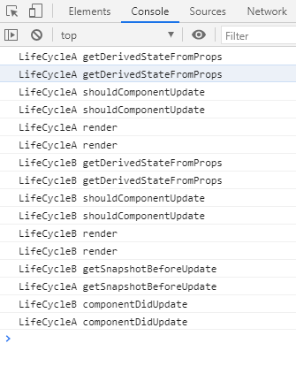

---

---

# Unmount Phase Method

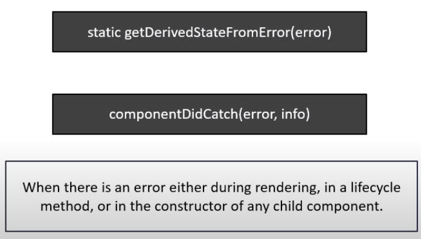

# Error Handling Phase Method

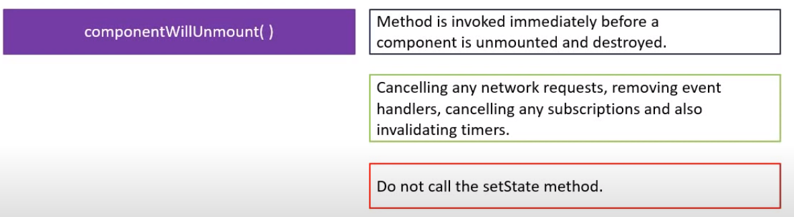

---

# **ADVANCED REACT**

---

# **Fragments**

---

## Def:

> Fragments basically lets you group a list of children elements without adding extra nodes to the DOM.

## Example 1:

`App.js`

```js
import React from "react";
import "./App.css";
import FragmentDemo from "./components/FragmentDemo";

function App() {
  return (
    <div className="App">
      <FragmentDemo></FragmentDemo>
    </div>
  );
}

export default App;
```

`FragmentDemo.js`

```js
import React from "react";

function FragmentDemo() {
  return (
    <div>
      <h1>Fragment Demo</h1>
      <p>
        Paragraphs Paragraphs Paragraphs Paragraphs Paragraphs Paragraphs
        Paragraphs
      </p>
    </div>
  );
}

export default FragmentDemo;
```

## Output:

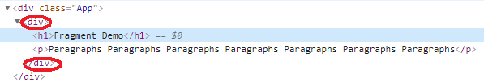

> Here we can wee we need an extra `<div></div>` (node) tag here.

### To Optimize this we have Fragments

`FragmentDemo.js`

```js
import React from "react";

function FragmentDemo() {
  return (
    <React.Fragment>
      <h1>Fragment Demo</h1>
      <p>
        Paragraphs Paragraphs Paragraphs Paragraphs Paragraphs Paragraphs
        Paragraphs
      </p>
    </React.Fragment>
  );
}

export default FragmentDemo;
```

> Here we use `<React.Fragment>` instead of `<div></div>`. So that one extra node is not here.

## Output:

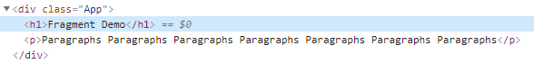

> We can see no `extra node` here.

---

## Example 2:

`App.js`

```js
import React from "react";
import "./App.css";
import Table from "./components/Table";

function App() {
  return (
    <div className="App">
      <Table />
    </div>
  );
}

export default App;
```

`Table.js`

```js
import React from "react";
import Columns from "./Columns";

function Table() {
  return (
    <table>
      <tbody>
        <tr>
          <Columns />
        </tr>
      </tbody>
    </table>
  );
}

export default Table;
```

`Columns.js`

```js
import React from "react";

function Columns() {
  return (
    <div>
      <td>Name</td>
      <td>Imrul</td>
    </div>
  );
}

export default Columns;
```

## Output:

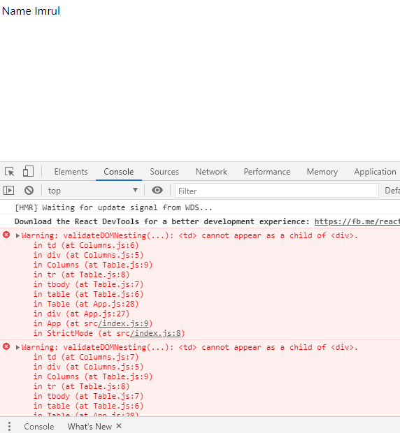

> Here we can see output is allright. But warnings appears in consol.

> Warnings Means: It's wrong to have a `<td>` element as a child of a `div>` tag.

## Reason

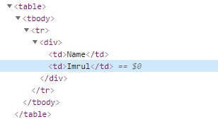

> We can see `td` is a child of `div` here. But it is wrong syntax. But for multiple element returning it is necessary to use `div` tag to bind them all. But it also wrong syntax in table.

## Solution

> Use `<React.Fragment><\React.Fragment>` to solve both problems

`Columns.js`

```js
import React from "react";

function Columns() {
  return (
    <React.Fragment>
      <td>Name</td>
      <td>Imrul</td>
    </React.Fragment>
  );
}

export default Columns;
```

---

## Key Point of Fragment:

- it accepts the `key` attribute when renduring list of items.

## Example:

`Columns.js`

```js
import React from "react";

function Columns() {
  const items = [];
  return (
    <React.Fragment>
      {items.map((item) => (
        <React.Fragment key={item.id}>
          <h1>Title</h1>
          <p>{item.title}</p>
        </React.Fragment>
      ))}
      <td>Name</td>
      <td>Imrul</td>
    </React.Fragment>
  );
}

export default Columns;
```

> It can pass the `key` to `Fragments`

---

> Is there any alternative of `</React.Fragment>`? Yes.

`Columns.js`

```js
import React from "react";

function Columns() {
  return (
    <>
      <td>Name</td>
      <td>Imrul</td>
    </>
  );
}

export default Columns;
```

> We can use `<></>` instead of `<React.Fragment></React.Fragment>` to render multiple elements

**BUT IT HAS ONE LIMITATION**

> We can not pass the `key` attribute as there are no `fragments`.

---

---

# **Pure Components**

---

## Shortcut `rpce` and tab

`App.js`

```js
import React from "react";
import "./App.css";
import PureComp from "./components/PureComp";

function App() {
  return (
    <div className="App">
      <PureComp></PureComp>
    </div>
  );
}

export default App;
```

`PureComp.js`

```js
import React, { PureComponent } from "react";

class PureComp extends PureComponent {
  render() {
    return <div>Pure Component</div>;
  }
}

export default PureComp;
```

---

> Output remains exactly same as `Regular Component` and this `Pure Component` class.

> What is the difference then?

## Example

`App.js`

```js
import React from "react";
import "./App.css";
import ParentComp from "./components/ParentComp";

function App() {
  return (
    <div className="App">
      <ParentComp />
    </div>
  );
}

export default App;
```

`ParentComp.js`

```js
import React, { Component } from "react";
import RegComp from "./RegComp";
import PureComp from "./PureComp";

export class ParentComp extends Component {
  constructor(props) {
    super(props);

    this.state = {
      name: "Imrul",
    };
  }

  componentDidMount() {
    setInterval(() => {
      this.setState({
        name: "Imrul",
      });
    }, 2000);
  }

  render() {
    console.log(
      "*****************************Parent Component Rendering********************************"
    );
    return (
      <div>
        Parent Component
        <RegComp name={this.state.name} />
        <PureComp name={this.state.name} />
      </div>
    );
  }
}

export default ParentComp;
```

`RegComp.js`

```js
import React, { Component } from "react";

class RegComp extends Component {
  render() {
    console.log("Regular Component Rendering");
    return <div>Regular Component : {this.props.name}</div>;
  }
}

export default RegComp;
```

`PureComp.js`

```js
import React, { PureComponent } from "react";

class PureComp extends PureComponent {
  render() {
    console.log("Pure Component Rendering");
    return <div>Pure Component : {this.props.name}</div>;
  }
}

export default PureComp;
```

## Output:

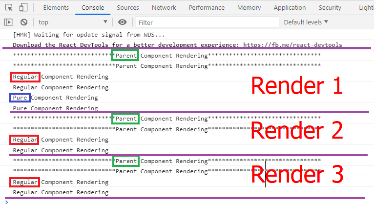

> Here in the console we can see the `Pure Component` renders for first render. But after that the `Regular Component` is rendering. This is the difference between the `Regular Componet` and `Pure Component`.

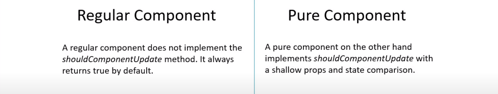

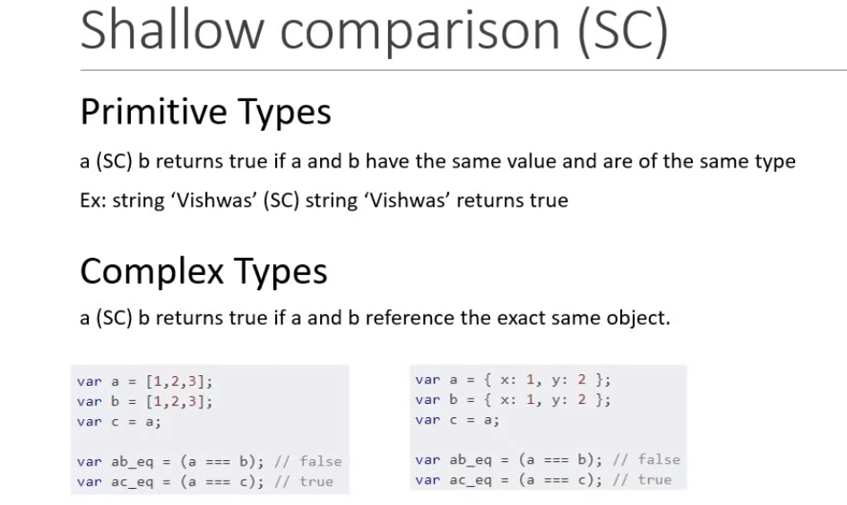

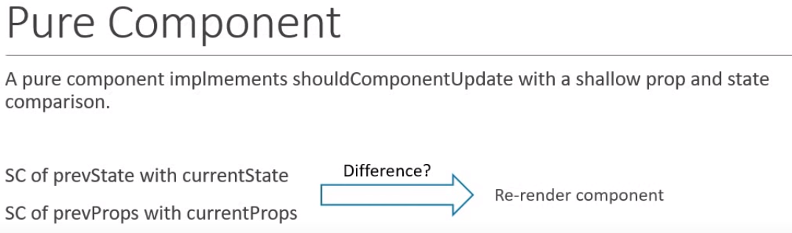

## Usefulness of Pure Componet:

- preventing unnecassary render can give you a performance boost in certain scenarios

## One Problem

- Should not mutate object or arrays in props or state. for example if you have list of items. You want to insert a new item. Because the reference of the array never changes and because pure component only checks for that the component will not re-render even of there is a difference.

### Solutiion?

- Always return a new object or array when dealing with pure components.

## Summary

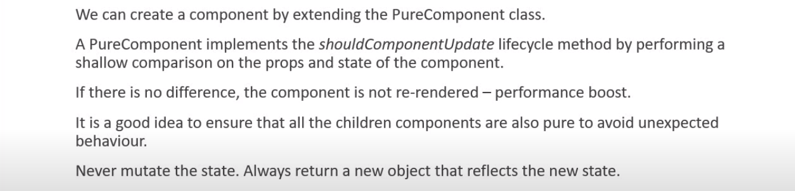

---

---

# **Memo**

---

> This is also helps to avoid unwanted renduring but in this case it's for Functional Component.

`App.js`

```js
import React from "react";
import "./App.css";
import ParentComp from "./components/ParentComp";

function App() {
  return (
    <div className="App">
      <ParentComp />
    </div>
  );
}

export default App;
```

`ParentComp.js`

```js
import React, { Component } from "react";
import RegComp from "./RegComp";
import PureComp from "./PureComp";
import MemoComp from "./MemoComp";

export class ParentComp extends Component {
  constructor(props) {
    super(props);

    this.state = {
      name: "Imrul",
    };
  }

  componentDidMount() {
    setInterval(() => {
      this.setState({
        name: "Imrul",
      });
    }, 2000);
  }

  render() {
    console.log(
      "*****************************Parent Component Rendering********************************"
    );
    return (
      <div>
        Parent Component
        <MemoComp name={this.state.name} />
      </div>
    );
  }
}

export default ParentComp;
```

`MemoComp.js`

```js
import React from "react";

function MemoComp({ name }) {
  console.log("Renduring Memo Component");
  return <div>{name}</div>;
}

export default MemoComp;
```

## Output

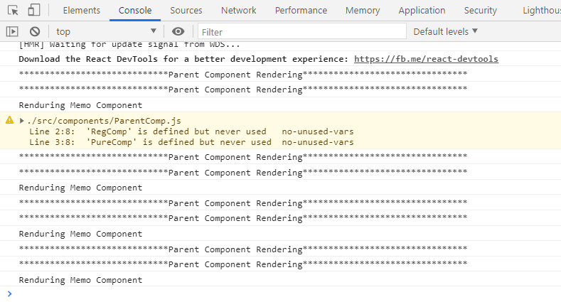

> But till now the `Memo Component` is rerenduring even if for the same state `name : 'Imrul'`.

## Solution?

> use `export default React.memo(MemoComp);` instead of `export default MemoComp;`

`MemoComp.js`

```js
import React from "react";

function MemoComp({ name }) {
  console.log("Renduring Memo Component");
  return <div>{name}</div>;
}

export default React.memo(MemoComp);
```

## Output

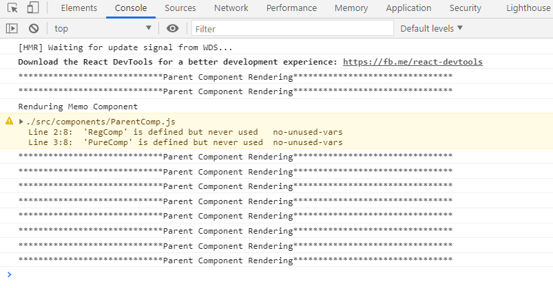

> Here we can see the re-rendering problem is not occurs here.

---

---

# **Refs**

---

`App.js`

```js
import React from "react";
import "./App.css";
import RefsDemo from "./components/RefsDemo";

function App() {
  return (
    <div className="App">
      <RefsDemo />
    </div>
  );
}

export default App;
```

`RefsDemo.js`

```js
import React, { Component } from "react";

class RefsDemo extends Component {
  render() {
    return (
      <div>
        <input type="text" />
      </div>
    );
  }
}

export default RefsDemo;
```

> Here we can see in the browser a input text field.

> But we want to focus on the text field as soon as the page loaded.

---

## Solution: Steps

- create a `ref` using `React.createRef();` inside the `constructor`
- attach the `ref` to the input element in the render method
  - to attach the `ref` we make use the reserved word `ref`
- call the focus method on the input element.

## Before Calling the third steps we just check the console to observe `ref`

`RefDemo.js`

```js
import React, { Component } from "react";

class RefsDemo extends Component {
  constructor(props) {
    super(props);

    this.inputRef = React.createRef();
  }

  componentDidMount() {
    console.log(this.inputRef);
  }
  render() {
    return (
      <div>
        <input type="text" ref={this.inputRef} />
      </div>
    );
  }
}

export default RefsDemo;
```

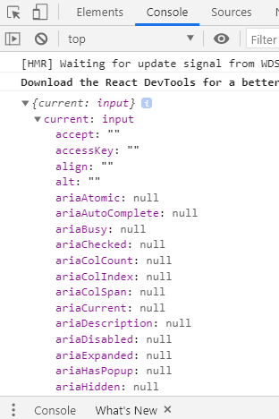

> We can clearly see the `ref` property called current of type `input` and this current property points to the actual DOM node.

> To focus on the input element in componentDidMount we simply call the focus method on the current property.

`RefDemo.js`

```js
import React, { Component } from "react";

class RefsDemo extends Component {
  constructor(props) {
    super(props);

    //#1 step
    this.inputRef = React.createRef();
  }

  // #3 step
  componentDidMount() {
    this.inputRef.current.focus();
    console.log(this.inputRef);
  }
  render() {
    return (
      <div>
        {/* #2 step */}
        <input type="text" ref={this.inputRef} />
      </div>
    );
  }
}

export default RefsDemo;
```

> Now we can check on the browser the input text field is focused as soon as the page loaded.

---

## 2nd Possible Use Case of using `Refs`

`RefsDemo.js`

```js
import React, { Component } from "react";

class RefsDemo extends Component {
  constructor(props) {
    super(props);
    //#1 step
    this.inputRef = React.createRef();
  }

  //#3 step
  componentDidMount() {
    this.inputRef.current.focus();
    console.log(this.inputRef);
  }

  clickHandler = () => {
    alert(this.inputRef.current.value);
  };
  render() {
    return (
      <div>
        <input type="text" ref={this.inputRef} />
        {/* #2 step */}
        <button onClick={this.clickHandler}>Click</button>
      </div>
    );
  }
}

export default RefsDemo;
```

## Output:


## Alternative of `Refs` using `CallbackRefs`

- Its older approach. But showing it for just to learn

### Steps

Four steps

`RefsDemo.js`

```js
import React, { Component } from "react";

class RefsDemo extends Component {
  constructor(props) {
    super(props);

    //#1 step
    this.cbRef = null;

    //#2 step
    this.setCbRef = (element) => {
      this.cbRef = element;
    };
  }

  componentDidMount() {
    //#4 step
    if (this.cbRef) {
      this.cbRef.focus();
      console.log(this.cbRef);
    }
  }

  clickHandler = () => {
    alert(this.cbRef.value);
  };
  render() {
    return (
      <div>
        {/* #3 */}
        <input type="text" ref={this.setCbRef} />
        <button onClick={this.clickHandler}>Click</button>
      </div>
    );
  }
}

export default RefsDemo;
```

## Documentation [Docx](https://reactjs.org/docs/refs-and-the-dom.html)

---

---

# **Refs with Class Components**

---

`App.js`

```js
import React from "react";
import "./App.css";
import FocusInput from "./components/FocusInput";

function App() {
  return (
    <div className="App">
      <FocusInput />
    </div>
  );
}

export default App;
```

`FocusInput.js`

```js
import React, { Component } from "react";
import Input from "./Input";

class FocusInput extends Component {
  constructor(props) {
    super(props);

    // #1 step
    this.componentRef = React.createRef();
  }

  // #3 step
  clickHandler = () => {
    this.componentRef.current.focusInput();
  };

  render() {
    return (
      <div>
        {/* #2 step */}
        <Input ref={this.componentRef} />
        <button onClick={this.clickHandler}>Focus Input</button>
      </div>
    );
  }
}

export default FocusInput;
```

`Input.js`

```js
import React, { Component } from "react";

class Input extends Component {
  constructor(props) {
    super(props);

    // #1 step
    this.inputRef = React.createRef();
  }

  // #3 step -- this functon will be called from Parent Component
  focusInput() {
    this.inputRef.current.focus();
  }
  render() {
    return (
      <div>
        {/* #2 step */}
        <input type="test" ref={this.inputRef} />
      </div>
    );
  }
}

export default Input;
```

> this is `ref` using Class Component.

> **Note:** Refs can't attach to the functional component. It can only be used using class component.

---

---

# **Forwarding Refs**

---

## 4 Steps

- Create a `ref` in the parent component.
- attach the `ref` to the child component using the `ref` attribute.
- we need to forward this `ref` to the input element in the child component.
  - forwarding can be achieved usign the forward draft method from the react library.
  - Modify the child functional component of `FRInput.js` to the arrow function.
  - To forward the `ref` we will use the `React.ForwardRef` method.
- define the `clickHandler` and set `this.inputRef.current.focus();`

## Code

`App.js`

```js
import React from "react";
import "./App.css";
import FRParentInput from "./components/FRParentInput";

function App() {
  return (
    <div className="App">
      <FRParentInput />
    </div>
  );
}

export default App;
```

`FRParentInput.js`

```js
import React, { Component } from "react";
import FRInput from "./FRInput";

class FRParentInput extends Component {
  constructor(props) {
    super(props);

    // #1 step
    this.inputRef = React.createRef();
  }

  // #4 step
  clickHandler = () => {
    this.inputRef.current.focus();
  };

  render() {
    return (
      <div>
        {/* #2 step */}
        <FRInput ref={this.inputRef} />
        <button onClick={this.clickHandler}>Focus Input</button>
      </div>
    );
  }
}

export default FRParentInput;
```

`FRInput.js`

```js
import React from "react";

// #3 step
const FRInput = React.forwardRef((props, ref) => {
  return (
    <div>
      <input type="text" ref={ref} />
    </div>
  );
});

export default FRInput;
```

> Same exact output.

> We can see after pressing button the focus goes on the input field.

> Advantages: Parent Compent can directly interact with the input elelment in the child component using `ref` thorugh passing the `ref` in the `arrow function` in child component.

---

---

# **Portals**

---

- **Def:** Provide a way to render children into a DOM node that exists outside the DOM Hierarchy of the parent component.

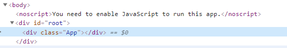

> We can see every single application is under the `root`.

- Portals provide the ability to break out of this DOM tree so you can render a component onto a DOM node that is not under this `root` element.

## Steps:

### Step 1:

- Create a new element with `id="portal-root"` inside `index.html` in `public` folder.

```html
<div id="portal-root"></div>
```

`index.html`

```html
<body>
  <noscript>You need to enable JavaScript to run this app.</noscript>
  <div id="root"></div>
  <div id="portal-root"></div>
</body>
```

### Step 2:

- Create a new component `PortalDemo.js` inside the `component` folder.

- Add the `component` in the `App.js` file.

`App.js`

```js
import React from "react";
import "./App.css";
import PortalDemo from "./components/PortalDemo";

function App() {
  return (
    <div className="App">
      <PortalDemo />
    </div>
  );
}

export default App;
```

`PortalDemo.js`

```js
import React from "react";

function PortalDemo() {
  return <h1>Portals Demo</h1>;
}

export default PortalDemo;
```

> We can see that the `JSX` is showing inside the element with `id=root`.

### Step 3:

- We will use `ReactDom.createPortal` method to insert this component under the `portal-root` node.

- We need to import `import ReactDOM from "react-dom"` package top of the `PortalDemo.js` file.

- In the `render` method instead of simply return the `JSX` we will return `ReactDOM.createPortal`
  - The method takes two parameters.
    - First Parameter: `JSX`
    - Second Parameter: `DOM Node` to mount the element.

`PortalDemo.js`

```js
import React from "react";
import ReactDOM from "react-dom";

function PortalDemo() {
  return ReactDOM.createPortal(
    <h1>Portals Demo</h1>,
    document.getElementById("portal-root")
  );
}

export default PortalDemo;
```

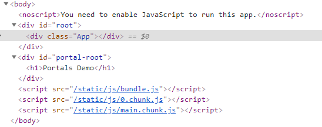

> We can see now, that the `JSX` is under the `portal-root` element.

> **Note:** One thing you notice that, All the children component is under `App` component. And the `App` component is mounted on the `root` DOM node, its possible to break away from that and mount on any DOM node you wish to using `ract portals`. So here although the `JSX` should be under the `App` component but instead it is under the `portal-root` element.

---

# More Advance on Portals`

> the first parameter to create portal can be any element that react can render it. It can be `numbers, strings, JSX, component`.

## **Question:** Why do we need them? What are the use case?

- having to deal with the parent components CSS when that child component is a modal a pop-up or a tool-tip

## Example

### Code:

- [link1](https://codesandbox.io/s/00254q4n6p)

## Output

### Normal Case

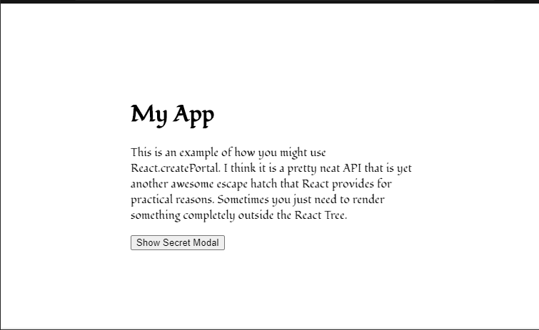

## Case 1: with portals

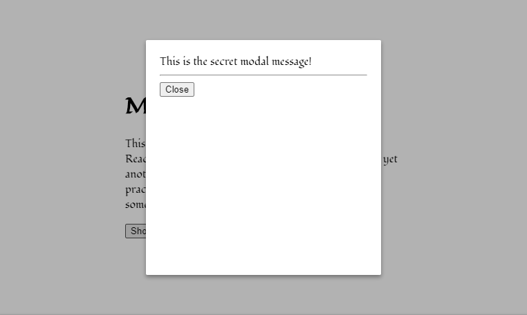

> Modal looks fine

## Case 2: without portals

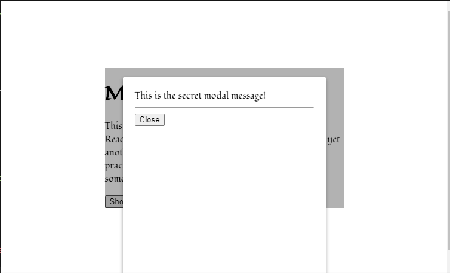

> Modal breaks. Because when it is under the `App` component directly then the `CSS` inside the `App` also reflects the `modal`. Because of the width restriction and that messes up the UI. So sometimes its useful to insert a child into a different location in the DOM and portals helps you do that.

---

## Portals is event bubbling

> Even though a portal can be anywhere in the DOM tree it behaves like a normal react child in every other way. This includes event bubbling. So an event fired from inside a portal will propegate to ancecstors in the containing react tree even if those elements are not ancestors in the DOM tree.

## Example

### Code:

- [Link2](https://codepen.io/gaearon/pen/jGBWpE)

- CLick on the `click` button and you can observe that the portal is behaving like a normal react in every other way.

---

---

# **Error Boundary**

---

## Error Handling Phase Method


### This error may comes.

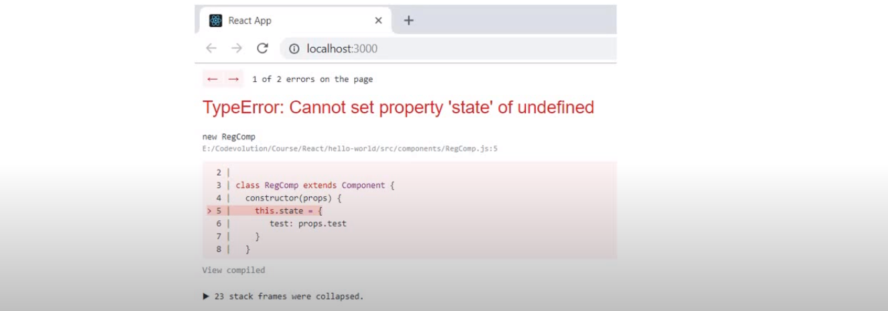

- React Basically unmount the whole react component tree

- We can catch the error and display a fallback UI.

### Error Boundary

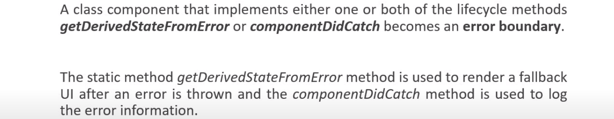

---

## Example

### Step 1

`App.js`

```js
import React from "react";
import "./App.css";
import Hero from "./components/Hero";

function App() {
  return (
    <div className="App">
      <Hero heroName="Batman" />
      <Hero heroName="Superman" />
    </div>
  );
}

export default App;
```

### Step 2

`Hero.js`

```js
import React from "react";

function Hero({ heroName }) {
  if (heroName == "Jocker") {
    throw new Error("Not A Hero");
  }
  return <div>{heroName}</div>;
}

export default Hero;
```

## Output shows both the `Batman` and `Superman`.

But now add this `<Hero heroName="Joker" />` to `App` component will produces an error in entire application.

> But only the responsible code should be fallback an UI for error. Not entire application.

## Solution: Using Error Boundary.

- Create a new file named `ErrorBoundary.js` in component folder.

- To catch the error boundary we need to define either `getDerivedFromStateFromError` or `componentDidCatch` life cycle method.

- wrap all the components for `<Hero>` inside the `<ErrorBoundary>` compoennt. So `<ErrorBoundary>` component is `Parent` in this case and `<Hero>` components are the childs.

## Technique 1 : getDerivedFromStateFromError

`App.js`

```js
import React from "react";
import "./App.css";
import ErrorBoundary from "./components/ErrorBoundary";
import Hero from "./components/Hero";

function App() {
  return (
    <div className="App">
      <ErrorBoundary>
        <Hero heroName="Batman" />
        <Hero heroName="Superman" />
        <Hero heroName="Joker" />
      </ErrorBoundary>
    </div>
  );
}

export default App;
```

> Wrapping all the `Hero` component inside `ErrorBoudnary` component.

`Hero.js`

```js
import React from "react";

function Hero({ heroName }) {
  if (heroName == "Joker") {
    throw new Error("Not A Hero");
  }
  return <div>{heroName}</div>;
}

export default Hero;
```

> Same as it is

`ErrorBoundary.js`

```js
import React, { Component } from "react";

class ErrorBoundary extends Component {
  constructor(props) {
    super(props);

    this.state = {
      hasError: false,
    };
  }

  // if an error comes then state property `hasError` will be true
  static getDerivedStateFromError(error) {
    return {
      hasError: true,
    };
  }

  render() {
    // if hasError == true
    if (this.state.hasError) {
      return <h1>Something Went Wrong</h1>;
    }

    // if hasError == false
    return this.props.children; //this refers to the component we are actually rendering
  }
}

export default ErrorBoundary;
```

## Output

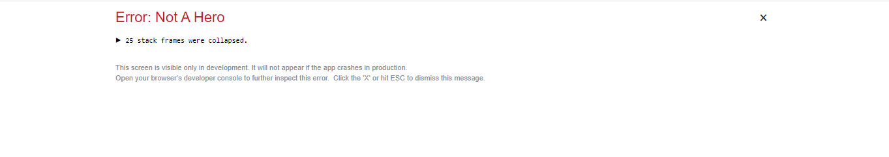

> Aftr pressing the cross sign.


> We can see in the Browser that still the error although we set e Error Message to display `Something went wrong`.

> **Reason:** In the Developemnt the catch of error display will not visible directly. After pressing the cross sign the error message will disply. But in the Production it will works without showing the errors.

---

## Where to place the `Error Boundary`?

- But notice when displaying in the browser, we can see that for error in one `Hero` component others `Hero` component is not visible. But we don't want it. We don't want all the components hide just because one component is in error.

### Solution?

`App.js`

```js
import React from "react";
import "./App.css";
import ErrorBoundary from "./components/ErrorBoundary";
import Hero from "./components/Hero";

function App() {
  return (
    <div className="App">
      <ErrorBoundary>
        <Hero heroName="Batman" />
      </ErrorBoundary>

      <ErrorBoundary>
        <Hero heroName="Superman" />
      </ErrorBoundary>

      <ErrorBoundary>
        <Hero heroName="Joker" />
      </ErrorBoundary>
    </div>
  );
}

export default App;
```

### Output


> Now displaying other `Hero` component also with the error also.

---

## Technique 2 : componentDidCatch

- `componentDidCatch` takes two parameter
  - error, info

Add Below function before rendering in `ErrorBoundary.js`

```js
componentDidCatch(error, info) {
    console.log(error);
    console.log(info);
}
```

`ErrorBoundary.js`

```js
import React, { Component } from "react";

class ErrorBoundary extends Component {
  constructor(props) {
    super(props);

    this.state = {
      hasError: false,
    };
  }

  // tech #1
  static getDerivedStateFromError(error) {
    return {
      hasError: true,
    };
  }

  // tech #2
  componentDidCatch(error, info) {
    console.log(error);
    console.log(info);
  }

  render() {
    if (this.state.hasError) {
      return <h1>Something Went Wrong</h1>;
    }
    return this.props.children; //this refers to the component we are actually rendering
  }
}

export default ErrorBoundary;
```

> We can see the log in console.

> Final Points: You should know that Error Boundaries catch errors during rendering in life cycle method and in the constructors of the whole tree below them. However they do not catch errors inside event handlers, if you have an onclick handler and want to catch an error you just need to use the regular `try catch statements` and not `error boundaries`.

### Summary:

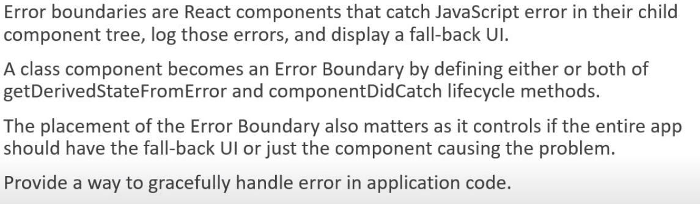

---

# **Higher Order Components (Part 1)**

---

### Click Functionality

`App.js`

```js
import React from "react";
import "./App.css";
import ClickCounter from "./components/ClickCounter";

function App() {
  return (
    <div className="App">
      <ClickCounter />
    </div>
  );
}

export default App;
```

`ClickCounter.js`

```js
import React, { Component } from "react";

class ClickCounter extends Component {
  constructor(props) {
    super(props);

    this.state = {
      count: 0,
    };
  }

  increamentCount = () => {
    this.setState((prevState) => {
      return { count: prevState.count + 1 };
    });
  };

  render() {
    const { count } = this.state;
    return (
      <div>
        <button onClick={this.increamentCount}>Click {count} Times</button>
      </div>
    );
  }
}

export default ClickCounter;
```

### Hover Functionality

`App.js`

```js
import React from "react";
import "./App.css";
import HoverCounter from "./components/HoverCounter";

function App() {
  return (
    <div className="App">
      <HoverCounter />
    </div>
  );
}

export default App;
```

`HoverCounter.js`

```js
import React, { Component } from "react";

class HoverCounter extends Component {
  constructor(props) {
    super(props);

    this.state = {
      count: 0,
    };
  }

  increamentCount = () => {
    this.setState((prevState) => {
      return { count: prevState.count + 1 };
    });
  };

  render() {
    const { count } = this.state;
    return (
      <div>
        <h2 onMouseOver={this.increamentCount}>Hover {count} Times</h2>
      </div>
    );
  }
}

export default HoverCounter;
```

> But we can see that the Click and Hover functionality have some same functions. But we duplicate these.

> How can we re-use them?

## Normal Case


## Complex Case

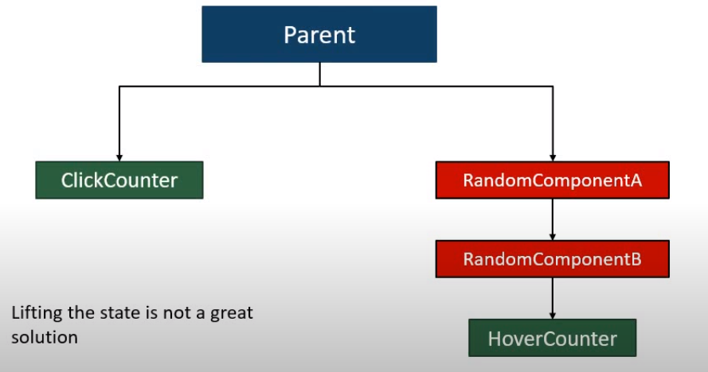

> Solution?

- Higher Order Component

---

# **Higher Order Components (Part 2)** | **HOC**

---


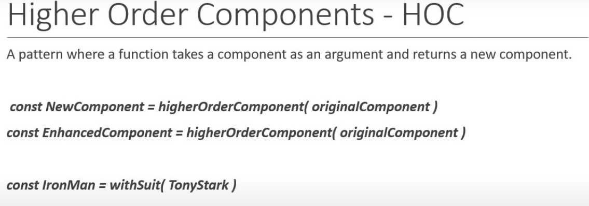

## Code

## Steps

-

`App.js`

```js
import React from "react";
import "./App.css";
import ClickCounter from "./components/ClickCounter";
import HoverCounter from "./components/HoverCounter";

function App() {
  return (
    <div className="App">
      <ClickCounter />
      <HoverCounter />
    </div>
  );
}

export default App;
```

`withCounter.js`

```js
import React, { Component } from "react";

const UpdatedComponent = (OriginalComponent) => {
  class NewComponent extends React.Component {
    render() {
      return <OriginalComponent name="Imrul" />;
    }
  }
  return NewComponent;
};

export default UpdatedComponent;
```

`ClickCounter.js`

```js
import React, { Component } from "react";
import UpdatedCompoent from "./withCounter"; //added for HOC

class ClickCounter extends Component {
  constructor(props) {
    super(props);

    this.state = {
      count: 0,
    };
  }

  increamentCount = () => {
    this.setState((prevState) => {
      return { count: prevState.count + 1 };
    });
  };

  render() {
    const { count } = this.state;
    return (
      <div>
        <button onClick={this.increamentCount}>
          {this.props.name} Click {count} Times
        </button>
      </div>
    );
  }
}

export default UpdatedComponent(ClickCounter); //here is a change from normal export
```

> Here `ClickCounter` is passed as parameter in `UpdatedComponent` and then then export it

`HoverCounter.js`

```js
import React, { Component } from "react";
import UpdatedCompoent from "./withCounter"; //added for HOC

class HoverCounter extends Component {
  constructor(props) {
    super(props);

    this.state = {
      count: 0,
    };
  }

  increamentCount = () => {
    this.setState((prevState) => {
      return { count: prevState.count + 1 };
    });
  };

  render() {
    const { count } = this.state;
    return (
      <div>
        <h2 onMouseOver={this.increamentCount}>
          {this.props.name} Hover {count} Times
        </h2>
      </div>
    );
  }
}

export default UpdatedComponent(HoverCounter); //here is a change from normal export
```

> Here `HoverCounter` is passed as parameter in `UpdatedComponent` and then then export it

## Output


> So out HOC injects a named property to any component required for our couter example though that is not really what we want.

> We want counter functionality to be shared amongs the components.

---

## Counter and Hover shared with HOC

`App.js`

```js
import React from "react";
import "./App.css";
import ClickCounter from "./components/ClickCounter";
import HoverCounter from "./components/HoverCounter";

function App() {
  return (
    <div className="App">
      <ClickCounter />
      <HoverCounter />
    </div>
  );
}

export default App;
```

`withCounter.js`

```js
import React, { Component } from "react";

const UpdatedComponent = (OriginalComponent) => {
  class NewComponent extends React.Component {
    constructor(props) {
      super(props);

      this.state = {
        count: 0,
      };
    }

    increamentCount = () => {
      this.setState((prevState) => {
        return { count: prevState.count + 1 };
      });
    };

    render() {
      return (
        <OriginalComponent
          count={this.state.count}
          increamentCount={this.increamentCount}
        />
      );
    }
  }
  return NewComponent;
};

export default UpdatedComponent;
```

> Here it accepts `OriginalComponent` as its parameter and return `NewComponent`.

> OriginalComponent referes to `ClickCounter` or `HoverCounter`.

> The `NewComponent` has functionality to maintian the state of account property and also a method to increament the Current Property. Both of them are passed as props to the `OriginalComponent`.

> The `OriginalComponent` enhance with these props and then return.

> The Control goes back to `ClickCounter` where the count and increamentCount props passed in from the `HOC` are destructurd and are used in the return statement.

> So the HOC is basically taking care of maintaining the state and increamenting it.

> Here we passed down the `state` and `increamentCount` method as props so that the `OriginalComponent` will make use of that functionality.

> Same thing happens for `HoverCounter`

> **Note:** Both `ClickCounter` and `HoverCounter` uses separate state. THey don't affects others state.

`ClickCounter.js`

```js
import React, { Component } from "react";
import UpdatedComponent from "./withCounter"; //added for HOC

class ClickCounter extends Component {
  render() {
    const { count, increamentCount } = this.props;
    return (
      <div>
        <button onClick={increamentCount}> Click {count} Times</button>
      </div>
    );
  }
}

export default UpdatedComponent(ClickCounter); //added
```

> Here we `destructure` the props into `count` and `increamentCount`.

`HoverCounter.js`

```js
import React, { Component } from "react";
import UpdatedComponent from "./withCounter"; //added

class HoverCounter extends Component {
  render() {
    const { count, increamentCount } = this.props;
    return (
      <div>
        <h2 onMouseOver={increamentCount}> Hover {count} Times</h2>
      </div>
    );
  }
}

export default UpdatedComponent(HoverCounter); //added
```

> Here we `destructure` the props into `count` and `increamentCount`.

## Output


> We can see the same output as before. But this time we don't have duplicate code. We just re-use the code snippet for counting for both the `ClickCounter` and `HoverCounter`.

---

## Using Some Naming Convension for HOC

`App.js`

```js
import React from "react";
import "./App.css";
import ClickCounter from "./components/ClickCounter";
import HoverCounter from "./components/HoverCounter";

function App() {
  return (
    <div className="App">
      <ClickCounter />
      <HoverCounter />
    </div>
  );
}

export default App;
```

`withCounter.js`

```js
import React, { Component } from "react";

const withCounter = (WrappedComponent) => {
  class withCounter extends React.Component {
    constructor(props) {
      super(props);

      this.state = {
        count: 0,
      };
    }

    increamentCount = () => {
      this.setState((prevState) => {
        return { count: prevState.count + 1 };
      });
    };

    render() {
      return (
        <WrappedComponent
          count={this.state.count}
          increamentCount={this.increamentCount}
        />
      );
    }
  }
  return withCounter;
};

export default withCounter;
```

`ClickCounter.js`

```js
import React, { Component } from "react";
import withCounter from "./withCounter"; //added for HOC

class ClickCounter extends Component {
  render() {
    const { count, increamentCount } = this.props;
    return (
      <div>
        <button onClick={increamentCount}> Click {count} Times</button>
      </div>
    );
  }
}

export default withCounter(ClickCounter); //added
```

`HoverCounter.js`

```js
import React, { Component } from "react";
import withCounter from "./withCounter"; //added

class HoverCounter extends Component {
  render() {
    const { count, increamentCount } = this.props;
    return (
      <div>
        <h2 onMouseOver={increamentCount}> Hover {count} Times</h2>
      </div>
    );
  }
}

export default withCounter(HoverCounter); //added
```

---

# **Passed props thought `ClickComponent` from `App`**

`App.js`

```js
import React from "react";
import "./App.css";
import ClickCounter from "./components/ClickCounter";
import HoverCounter from "./components/HoverCounter";

function App() {
  return (
    <div className="App">
      <ClickCounter name="Imrul" />
      <HoverCounter />
    </div>
  );
}

export default App;
```

> Here we pass a property name to `ClickCounter`.

`ClickCounter.js`

```js
import React, { Component } from "react";
import withCounter from "./withCounter"; //added for HOC

class ClickCounter extends Component {
  render() {
    const { count, increamentCount } = this.props;
    return (
      <div>
        <button onClick={increamentCount}>
          {this.props.name} Click {count} Times
        </button>
      </div>
    );
  }
}

export default withCounter(ClickCounter); //added
```

> We set `{this.props.name}` into the return statement. But props is not showing.

> Why? Because we don't pass the props directly to the `ClickController` when using `HOC`. The props is send to the `HOC` here which is `withCounter`.

> We need to send the props from `HOC`.

`withCounter.js`

```js
import React, { Component } from "react";

const withCounter = (WrappedComponent) => {
  class withCounter extends React.Component {
    constructor(props) {
      super(props);

      this.state = {
        count: 0,
      };
    }

    increamentCount = () => {
      this.setState((prevState) => {
        return { count: prevState.count + 1 };
      });
    };

    render() {
      return (
        <WrappedComponent
          count={this.state.count}
          increamentCount={this.increamentCount}
          {...this.props}
        />
      );
    }
  }
  return withCounter;
};

export default withCounter;
```

> Here using `{...this.props}` we passed all the props to `WrappedComponent`. If no props availbale for `WrappedComponent` then nothing will send.

---

## Passing Parameters to the HOC.

`App.js`

```js
import React from "react";
import "./App.css";
import ClickCounter from "./components/ClickCounter";
import HoverCounter from "./components/HoverCounter";

function App() {
  return (
    <div className="App">
      <ClickCounter name="Imrul" />
      <HoverCounter />
    </div>
  );
}

export default App;
```

`withCounter.js`

```js
import React, { Component } from "react";

const withCounter = (WrappedComponent, increamentNumber) => {
  class withCounter extends React.Component {
    constructor(props) {
      super(props);

      this.state = {
        count: 0,
      };
    }

    increamentCount = () => {
      this.setState((prevState) => {
        return { count: prevState.count + increamentNumber };
      });
    };

    render() {
      return (
        <WrappedComponent
          count={this.state.count}
          increamentCount={this.increamentCount}
          {...this.props}
        />
      );
    }
  }
  return withCounter;
};

export default withCounter;
```

> `const withCounter = (WrappedComponent, increamentNumber)`

`ClickCounter.js`

```js
import React, { Component } from "react";
import withCounter from "./withCounter"; //added for HOC

class ClickCounter extends Component {
  render() {
    const { count, increamentCount } = this.props;
    return (
      <div>
        <button onClick={increamentCount}>
          {this.props.name} Click {count} Times
        </button>
      </div>
    );
  }
}

export default withCounter(ClickCounter, 5);
```

> `export default withCounter(ClickCounter, 5);`

`HoverCounter.js`

```js
import React, { Component } from "react";
import withCounter from "./withCounter"; //added

class HoverCounter extends Component {
  render() {
    const { count, increamentCount } = this.props;
    return (
      <div>
        <h2 onMouseOver={increamentCount}> Hover {count} Times</h2>
      </div>
    );
  }
}

export default withCounter(HoverCounter, 10); //added
```

> `export default withCounter(HoverCounter, 10);`

---

# **Render Props**

---

## Why there is need for render props?

- Its a alternative approach of `HOC Pattern` for re-using code without duplicating of code.

`App.js`

```js
import React from "react";
import "./App.css";
import ClickCounterTwo from "./components/ClickCounterTwo";
import HoverCounterTwo from "./components/HoverCounterTwo";

function App() {
  return (
    <div className="App">
      <ClickCounterTwo />
      <HoverCounterTwo />
    </div>
  );
}

export default App;
```

`ClickCounterTwo.js`

```js
import React, { Component } from "react";

class ClickCounterTwo extends Component {
  constructor(props) {
    super(props);

    this.state = {
      count: 0,
    };
  }

  increamentCount = () => {
    this.setState((prevState) => {
      return { count: prevState.count + 1 };
    });
  };

  render() {
    const { count } = this.state;
    return (
      <div>
        <button onClick={this.increamentCount}>CLick {count} Time</button>
      </div>
    );
  }
}

export default ClickCounterTwo;
```

`HoverCounter.js`

```js
import React, { Component } from "react";

class HoverCounterTwo extends Component {
  constructor(props) {
    super(props);

    this.state = {
      count: 0,
    };
  }

  increamentCount = () => {
    this.setState((prevState) => {
      return { count: prevState.count + 1 };
    });
  };

  render() {
    const { count } = this.state;

    return <h2 onMouseOver={this.increamentCount}>Hover {count} Times</h2>;
  }
}

export default HoverCounterTwo;
```

- Here we can see we duplicate some functionality. So we need to re-use system.

- Like `HOC Pattern` there is another Approach which is `Render Props Patten`.

## Using Render Props Pattern

- Create a new Component named `User.js`

`User.js`

```js
import React, { Component } from "react";

class User extends Component {
  render() {
    return <div>{this.props.name}</div>;
  }
}

export default User;
```

Add below lines in `App` component

`App.js`

```js
<User name="Imrul" />
```

Change the name props like below code

`App.js`

```js
<User name={() => "Imrul"} />
```

`User.js`

```js
import React, { Component } from "react";

class User extends Component {
  render() {
    return <div>{this.props.name()}</div>;
  }
}

export default User;
```

> `{this.props.name()}` Here we can see `name` as function not string. So add `()` at the end of `name`

> For the next step I want to have parameters to the function in the name props. Based on the paremeter, I want to change what is rendered by the User component.

`App.js`

```js
<User name={(isLoggedIn) => (isLoggedIn ? "Imrul" : "Guest")} />
```

ANd in User Component

`User.js`

```js
return <div>{this.props.name(true)}</div>;
```

`App.js`

```js
<User render={(isLoggedIn) => (isLoggedIn ? "Imrul" : "Guest")} />
```

`User.js`

```js
return <div>{this.props.render(true)}</div>;
```

> Here render will not conflict.

> The Term `Render Props` refers to a technique for sharing code between React components using props whose value is a function.

---

## Understand using Code

> Now the task is to share common functionality which are `constructor` and `increamentCount` using `Render Props`.

## Render Props Technique

`App.js`

```js
import React from "react";
import "./App.css";
import ClickCounterTwo from "./components/ClickCounterTwo";
import HoverCounterTwo from "./components/HoverCounterTwo";
import CounterTwo from "./components/CounterTwo";

function App() {
  return (
    <div className="App">
      <CounterTwo
        render={(count, increamentCount) => (
          <ClickCounterTwo count={count} increamentCount={increamentCount} />
        )}
      />

      <CounterTwo
        render={(count, increamentCount) => (
          <HoverCounterTwo count={count} increamentCount={increamentCount} />
        )}
      />
    </div>
  );
}

export default App;
```

> Render Props is the `ClickCounterTwo` to component the count state and increament count method from the counter component are passed as props to the ClickCOunterTwo COmponent. The `ClickCounterTwo` component makes use of the passed in props to render the actual UI. When you click on the Button and Call the increamentCount method or try to display the count value it is very much what the Counter component has provided. It is also what happens with the HoverCounterTwo component.

> So even though they share the common code the counter component instance will be different and hence there is no conflict between the count state values.

`ClickCounter.js`

```js
import React, { Component } from "react";

class ClickCounterTwo extends Component {
  render() {
    const { count, increamentCount } = this.props;
    return (
      <div>
        <button onClick={increamentCount}>CLick {count} Time</button>
      </div>
    );
  }
}

export default ClickCounterTwo;
```

`HoverCounter.js`

```js
import React, { Component } from "react";

class HoverCounterTwo extends Component {
  render() {
    const { count, increamentCount } = this.props;

    return <h2 onMouseOver={increamentCount}>Hover {count} Times</h2>;
  }
}

export default HoverCounterTwo;
```

`CounterTwo.js`

```js
import React, { Component } from "react";

class CounterTwo extends Component {
  constructor(props) {
    super(props);

    this.state = {
      count: 0,
    };
  }

  increamentCount = () => {
    this.setState((prevState) => {
      return { count: prevState.count + 1 };
    });
  };

  render() {
    return (
      <div>{this.props.render(this.state.count, this.increamentCount)}</div>
    );
  }
}

export default CounterTwo;
```

---

## Some simple changes

In App Component

- There is a variation of the render props pattern which doesn't make use of the props. Instead the `Children` props is used.

- Instead of render props we pass in the function in between the component opening and closing tags.

`App.js`

```js
import React from "react";
import "./App.css";
import ClickCounterTwo from "./components/ClickCounterTwo";
import CounterTwo from "./components/CounterTwo";
import HoverCounterTwo from "./components/HoverCounterTwo";

function App() {
  return (
    <div className="App">
      <CounterTwo>
        {(count, increamentCount) => (
          <ClickCounterTwo count={count} increamentCount={increamentCount} />
        )}
      </CounterTwo>

      <CounterTwo>
        {(count, increamentCount) => (
          <HoverCounterTwo count={count} increamentCount={increamentCount} />
        )}
      </CounterTwo>
    </div>
  );
}

export default App;
```

> Passed as children.

`ClickCounterTwo.js`

```js
import React, { Component } from "react";

class ClickCounterTwo extends Component {
  render() {
    const { count, increamentCount } = this.props;
    return (
      <div>
        <button onClick={increamentCount}>CLick {count} Time</button>
      </div>
    );
  }
}

export default ClickCounterTwo;
```

`HoverCounterTwo.js`

```js
import React, { Component } from "react";

class HoverCounterTwo extends Component {
  render() {
    const { count, increamentCount } = this.props;

    return <h2 onMouseOver={increamentCount}>Hover {count} Times</h2>;
  }
}

export default HoverCounterTwo;
```

`CounterTwo.js`

```js
import React, { Component } from "react";

class CounterTwo extends Component {
  constructor(props) {
    super(props);

    this.state = {
      count: 0,
    };
  }

  increamentCount = () => {
    this.setState((prevState) => {
      return { count: prevState.count + 1 };
    });
  };

  render() {
    return (
      <div>{this.props.children(this.state.count, this.increamentCount)}</div>
    );
  }
}

export default CounterTwo;
```

> `this.props.children` instead of `this.props.render`. As everything enclosed between opening and closing tag refers the childrens of the tag.

---

## FLow of `Rendering Props`:

### Step 1

- In `CounterTwo.js` component we can see `<div>{this.props.children(this.state.count, this.increamentCount)}</div>`. Here it returns `count` and `increamentCount` function to the `children` of `CounterTwo` component. In `App.js` `ClickCounterTwo.js` and `HoverCounterTwo.js` are childrens for `CounterTwo.js`

### Step 2:

- Here in `App.js` component `(count, increamentCount)` return from `CounterTwo.js` component. So here these values acts as parameters and passed to `ClickCounterTwo` component as **props**.

### Step 3:

- In `ClickCounterTwo.js` component `props` are destructed using `const { count, increamentCount } = this.props;`.

- `<button onClick={increamentCount}>CLick {count} Time</button>`. Here `count` and `increamentCount` is controlled by this button in `ClickCounterTwo.js`

---

# **Context**

---

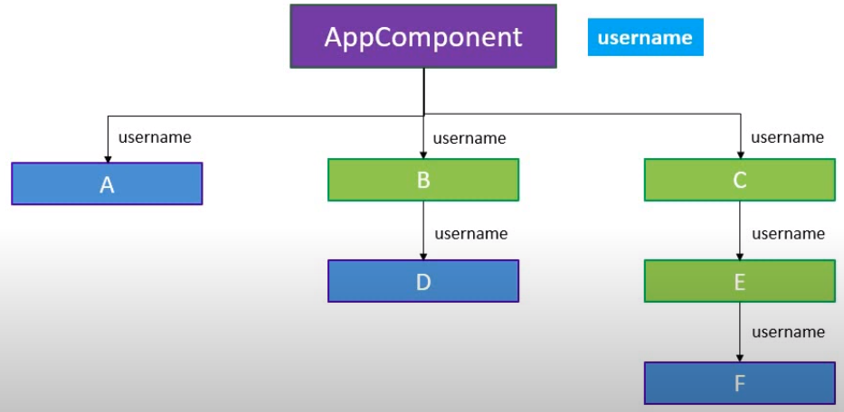

> Context provides a way to pass data through the component tree without having to pass props down manually at every level.

---

## Initial States

`App.js`

```js
import React from "react";
import "./App.css";
import ComponentC from "./components/ComponentC";

function App() {
  return (
    <div className="App">
      <ComponentC />
    </div>
  );
}

export default App;
```

`ComponentC.js`

```js
import React, { Component } from "react";
import ComponentE from "./ComponentE";

export class ComponentC extends Component {
  render() {
    return <ComponentE />;
  }
}

export default ComponentC;
```

`ComponentE.js`

```js
import React, { Component } from "react";
import ComponentF from "./ComponentF";

export class ComponentE extends Component {
  render() {
    return <ComponentF />;
  }
}

export default ComponentE;
```

`ComponentF.js`

```js
import React, { Component } from "react";

export class ComponentF extends Component {
  render() {
    return <div>Component F</div>;
  }
}

export default ComponentF;
```

---

> Now I will do how to get data from `App` component to `ComponentF` without passing through all intermidiate component.

## Steps

1. Create the Context
2. Provide a context value
3. Consume the context value

---

### Step #1

`userContext.js`

```js
import React from "react";

const UserContext = React.createContext();

const UserProvider = UserContext.Provider;
const UserConsumer = UserContext.Consumer;

export { UserProvider, UserConsumer };
```

### Step #2

- We need to provide this `userContext` using the `UserProvider` component.

- And the place you provide is important. Because only the descendant components can consume it.

- `App` component is usually a good place because pretty much all components fall under it.

- So in `App` component, I will wrap `ComponentC` with `UserProvider`.

`App.js`

```js
import React from "react";
import "./App.css";
import ComponentC from "./components/ComponentC";
import { UserProvider } from "./components/userContext";

function App() {
  return (
    <div className="App">
      <UserProvider>
        <ComponentC />
      </UserProvider>
    </div>
  );
}

export default App;
```

> Now `ProviderComponent` is responsible for providing a value for all the descendant components. The value we want to provide is the `username` using **value** attribute inside `UserProvider` component.

`App.js`

```js
import React from "react";
import "./App.css";
import ComponentC from "./components/ComponentC";
import { UserProvider } from "./components/userContext";

function App() {
  return (
    <div className="App">
      <UserProvider value="Imrul">
        <ComponentC />
      </UserProvider>
    </div>
  );
}

export default App;
```

### Step #3

> Now the `username` can be consumed by `ComponentC` and any component nested inside `ComponentC`.

> Now our task is to consume the `username` from our desired component.

> For our demo, We will consume the `username` for `ComponentF`.

> To consume a `context value` we need to user `Consumer Component`.

> So in `ComponentF` in render method as part of the return statement includes the `UserConsumer` component and import it in the top.

`ComponentF.js`

```js
import React, { Component } from "react";
import { UserConsumer } from "./userContext";

export class ComponentF extends Component {
  render() {
    return (
      <UserConsumer>
        {(username) => {
          return <div>Hello {username}</div>;
        }}
      </UserConsumer>
    );
  }
}

export default ComponentF;
```

## Final Flow (Fresh)

## Context API Using **Consumer Component**

`App.js`

```js
import React from "react";
import "./App.css";
import ComponentC from "./components/ComponentC";
import { UserProvider } from "./components/userContext";

function App() {
  return (
    <div className="App">
      <UserProvider value="Imrul">
        <ComponentC />
      </UserProvider>
    </div>
  );
}

export default App;
```

`userContext.js`

```js
import React from "react";

const UserContext = React.createContext();

const UserProvider = UserContext.Provider;
const UserConsumer = UserContext.Consumer;

export { UserProvider, UserConsumer };
```

`ComponentC.js`

```js
import React, { Component } from "react";
import ComponentE from "./ComponentE";

export class ComponentC extends Component {
  render() {
    return <ComponentE />;
  }
}

export default ComponentC;
```

`ComponentE.js`

```js
import React, { Component } from "react";
import ComponentF from "./ComponentF";

export class ComponentE extends Component {
  render() {
    return <ComponentF />;
  }
}

export default ComponentE;
```

`ComponentF.js`

```js
import React, { Component } from "react";
import { UserConsumer } from "./userContext";

export class ComponentF extends Component {
  render() {
    return (
      <UserConsumer>
        {(username) => {
          return <div>Hello {username}</div>;
        }}
      </UserConsumer>
    );
  }
}

export default ComponentF;
```

## Output:


---

## Few More Points on **Context API**

---

1. **Point #1** Default Value: You can set a default value to your context. Default value is set while creating a context. It is passed as an argument to the create context method.

2. **Point #2** Context Type Property: Instead of Context value there is another way to consume which is Context TYpe property on a class. Export the userContext itself.

`userContext.js`

```js
import React from "react";

const UserContext = React.createContext("Backstreet Imrul");

const UserProvider = UserContext.Provider;
const UserConsumer = UserContext.Consumer;

export { UserProvider, UserConsumer };
```

And comment out the `UserProvider`.

`App.js`

```js
<div className="App">
  <ComponentC />;
</div>
```

> We can see that the default value is showing.

`userContext.js`

```js
import React from "react";

const UserContext = React.createContext("Backstreet Imrul");

const UserProvider = UserContext.Provider;
const UserConsumer = UserContext.Consumer;

export { UserProvider, UserConsumer };
export default UserContext;
```

- assign this userContext to context type property on the class.

`ComponentE.js`

```js
import React, { Component } from "react";
import ComponentF from "./ComponentF";
import UserContext from "./userContext";

export class ComponentE extends Component {
  render() {
    return <ComponentF />;
  }
}

ComponentE.contextType = UserContext;

export default ComponentE;
```

---

## Context API Using **Context Type Property**

> For this example I will get the `username` form `CompoentE` using this method.

`App.js`

```js
import React from "react";
import "./App.css";
import ComponentC from "./components/ComponentC";
import { UserProvider } from "./components/userContext";

function App() {
  return (
    <div className="App">
      <UserProvider value="Imrul">
        <ComponentC />
      </UserProvider>
    </div>
  );
}

export default App;
```

`userContext.js`

```js
import React from "react";

const UserContext = React.createContext("Backstreet Imrul");

const UserProvider = UserContext.Provider;
const UserConsumer = UserContext.Consumer;

export { UserProvider, UserConsumer };
export default UserContext;
```

`ComponentC.js`

```js
import React, { Component } from "react";
import ComponentE from "./ComponentE";

export class ComponentC extends Component {
  render() {
    return <ComponentE />;
  }
}

export default ComponentC;
```

`ComponentE.js`

```js
import React, { Component } from "react";
import ComponentF from "./ComponentF";
import UserContext from "./userContext";

export class ComponentE extends Component {
  // static contextType = UserContext;

  render() {
    return (
      <div>
        Component E context {this.context}
        <ComponentF />
      </div>
    );
  }
}

ComponentE.contextType = UserContext;

export default ComponentE;
```

> If your application support the **Public Class View Syntax** you can replace `ComponentE.contextType = UserContext;` with `static contextType = UserContext` for same output.

## Output


---

## Now You might think that **Context Type Property** is much simplier that **Consumer Component Tech**.

> But we should not just stick to context type.

Two Limitation.

1. It only works with `Class Components`.
2. You can subscribe to a single context using **Context Type Property**.

> Below is the code how multiple context is consumed using **Consumer Component Method**

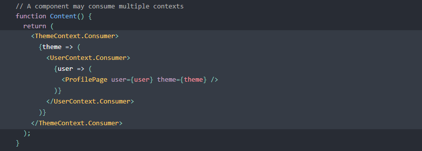

---

---

---

---

---

---

---

---

---

---

---

---

# **HTTP and React**

---


---

## Create new App

```cmd
~$ npx create-react-app react-http
```

```cmd
~$ cd react-http
```

## Install Axios

```cmd
~$ npm install axios
```

---

# **HTTP GET Request**

---

> We will learn how to make a get request using axios and render the fetched data in react component.

> To fetch the data we need to have an API end point. For that I will be making use of JSON placeholder.

> [Rest API Testing API](https://jsonplaceholder.typicode.com)

> We will focus on fetch data not creating API.

> [GET method: posts](https://jsonplaceholder.typicode.com/posts)

## Step 1:

### Create PostList component and add it to App component

`App.js`

```js
import React from "react";
import "./App.css";
import PostList from "./components/PostList";

function App() {
  return (
    <div className="App">
      <PostList />
    </div>
  );
}

export default App;
```

`PostList.js`

```js
import React, { Component } from "react";

class PostList extends Component {
  render() {
    return (
      <div>
        <h3>List of Posts</h3>
      </div>
    );
  }
}

export default PostList;
```

## Step 2:

### Now Fetching Posts from API

- Import `axios` library on top

`PostList.js`

```js
import React, { Component } from "react";
import axios from "axios";

class PostList extends Component {
  render() {
    return (
      <div>
        <h3>List of Posts</h3>
      </div>
    );
  }
}

export default PostList;
```

- create a state property which will store the list of posts.

`PostList.js`

```js
import React, { Component } from "react";
import axios from "axios";

class PostList extends Component {
  constructor(props) {
    super(props);

    this.state = {
      posts: [],
    };
  }

  render() {
    return (
      <div>
        <h3>List of Posts</h3>
      </div>
    );
  }
}

export default PostList;
```

- Use `Axios` to make a get request to the JSON placeholder API.
- Where do we place the code to make the get request ?

  - Ans: In the `componentDidMount` life cycle method.
  - this method will be executed when the component mounts for the first time and this only executed once during component lifetime. A perfect place for GET request.

- To make a GET request we invoke the GET method on the axios library.
- axios.get(). This method accepts the API endpoint as its argument.

`PostList.js`

```js
import React, { Component } from "react";
import axios from "axios";

class PostList extends Component {
  constructor(props) {
    super(props);

    this.state = {
      posts: [],
    };
  }

  componentDidMount() {
    axios.get("https://jsonplaceholder.typicode.com/posts");
  }

  render() {
    return (
      <div>
        <h3>List of Posts</h3>
      </div>
    );
  }
}

export default PostList;
```

- But how do we access the data that is returned.
- Axios is a promise based library. So we can add them and catch blocks.

`PostList.js`

```js
import React, { Component } from "react";
import axios from "axios";

class PostList extends Component {
  constructor(props) {
    super(props);

    this.state = {
      posts: [],
    };
  }

  componentDidMount() {
    axios
      .get("https://jsonplaceholder.typicode.com/posts")
      .then((Response) => {
        console.log(Response);
      })
      .catch((error) => {
        console.log(error);
      });
  }

  render() {
    return (
      <div>
        <h3>List of Posts</h3>
      </div>
    );
  }
}

export default PostList;
```

> Now go back to the browser and look at the console. And expand object->data.

> You will see all the data fetched from API.

- Now how to render these data in `JSX` using rendering.

`PostList.js`

```js
import React, { Component } from "react";
import axios from "axios";

class PostList extends Component {
  constructor(props) {
    super(props);

    this.state = {
      posts: [],
    };
  }

  componentDidMount() {
    axios
      .get("https://jsonplaceholder.typicode.com/posts")
      .then((response) => {
        console.log(response);
        this.setState({ posts: response.data });
      })
      .catch((error) => {
        console.log(error);
      });
  }

  render() {
    const { posts } = this.state;
    return (
      <div>
        <h3>List of Posts</h3>
        {posts.length
          ? posts.map((post) => <div key={post.id}>{post.title}</div>)
          : null}
      </div>
    );
  }
}

export default PostList;
```

> How to display Error Message when API fails?

### Finally Complete File of HTTP GET

`PostList.js`

```js
import React, { Component } from "react";
import axios from "axios";

class PostList extends Component {
  constructor(props) {
    super(props);

    this.state = {
      posts: [],
      errorMsg: "",
    };
  }

  componentDidMount() {
    axios
      .get("https://jsonplaceholder.typicode.com/posts")
      .then((response) => {
        console.log(response);
        this.setState({ posts: response.data });
      })
      .catch((error) => {
        console.log(error);
        this.setState({ errorMsg: "Error Retreiving Data" });
      });
  }

  render() {
    const { posts, errorMsg } = this.state;
    return (
      <div>
        <h3>List of Posts</h3>
        {posts.length
          ? posts.map((post) => <div key={post.id}>{post.title}</div>)
          : null}
        {errorMsg ? <div>{errorMsg}</div> : null}
      </div>
    );
  }
}

export default PostList;
```

---

---

# HTTP POST Request

---

`App.js`

```js
import React from "react";
import "./App.css";
import PostForm from "./components/PostForm";

function App() {
  return (
    <div className="App">
      <PostForm />
    </div>
  );
}

export default App;
```

`PostForm.js`

```js
import React, { Component } from "react";

class PostForm extends Component {
  constructor(props) {
    super(props);

    this.state = {
      userId: "",
      title: "",
      body: "",
    };
  }

  changeHandler = (e) => {
    this.setState({ [e.target.name]: e.target.value });
  };

  submitHandler = (e) => {
    e.preventDefault();
    console.log(this.state);
  };

  render() {
    const { userId, title, body } = this.state;
    return (
      <div>
        <form onSubmit={this.submitHandler}>
          <div>
            <input
              type="text"
              name="userId"
              value={userId}
              placeholder="User Id"
              onChange={this.changeHandler}
            />
          </div>
          <div>
            <input
              type="text"
              name="title"
              value={title}
              placeholder="Title"
              onChange={this.changeHandler}
            />
          </div>
          <div>
            <input
              type="text"
              name="body"
              value={body}
              placeholder="Body"
              onChange={this.changeHandler}
            />
          </div>
          <button type="submit">Submit</button>
        </form>
      </div>
    );
  }
}

export default PostForm;
```

## Output

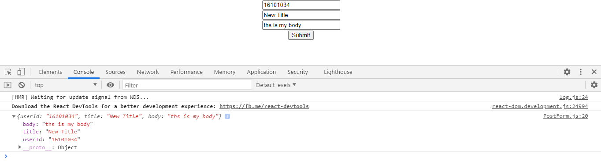

---

## Post Request using Axios

`PostForm.js`

```js
import React, { Component } from "react";
import axios from "axios";

class PostForm extends Component {
  constructor(props) {
    super(props);

    this.state = {
      userId: "",
      title: "",
      body: "",
    };
  }

  changeHandler = (e) => {
    this.setState({ [e.target.name]: e.target.value });
  };

  submitHandler = (e) => {
    e.preventDefault();
    console.log(this.state);
    axios
      .post("https://jsonplaceholder.typicode.com/posts", this.state)
      .then((response) => {
        console.log(response);
      })
      .catch((error) => {
        console.log(error);
      });
  };

  render() {
    const { userId, title, body } = this.state;
    return (
      <div>
        <form onSubmit={this.submitHandler}>
          <div>
            <input
              type="text"
              name="userId"
              value={userId}
              placeholder="User Id"
              onChange={this.changeHandler}
            />
          </div>
          <div>
            <input
              type="text"
              name="title"
              value={title}
              placeholder="Title"
              onChange={this.changeHandler}
            />
          </div>
          <div>
            <input
              type="text"
              name="body"
              value={body}
              placeholder="Body"
              onChange={this.changeHandler}
            />
          </div>
          <button type="submit">Submit</button>
        </form>
      </div>
    );
  }
}

export default PostForm;
```

## Output

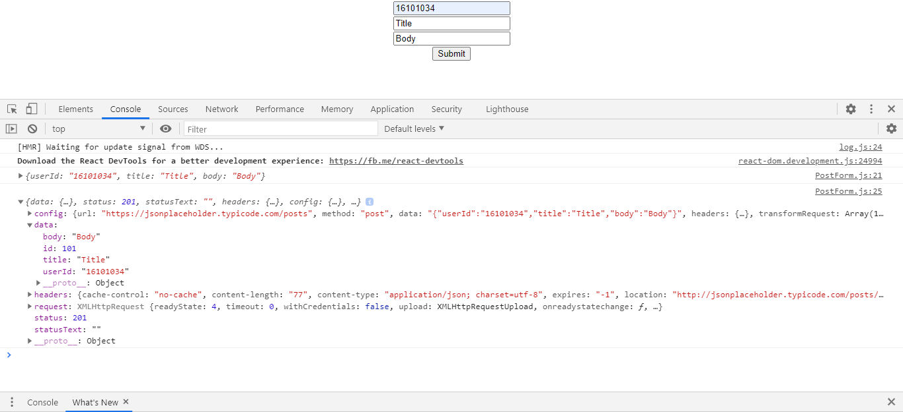

---

---

---

---

---

---

---

---

# **REACT HOOKS**

---

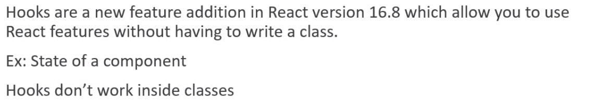

## Reason

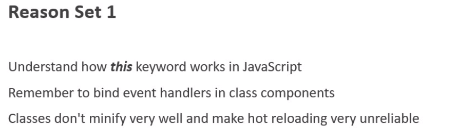

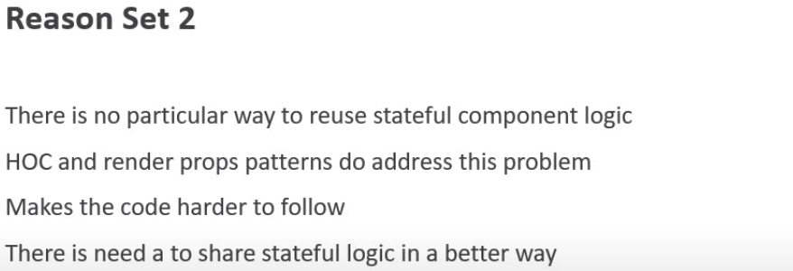

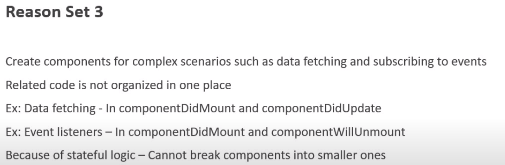

## Nothorthy Points

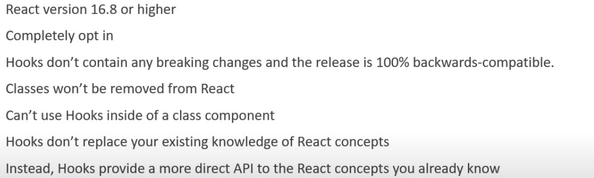

## Summary

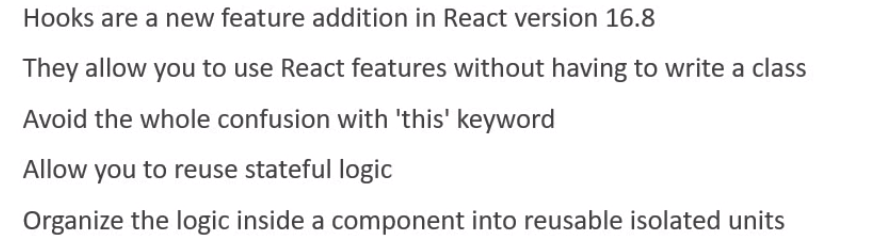

---

---

# **useState** Hooks

---

## Counter using Hooks

`App.js`

```js
import React from "react";
import "./App.css";
import HookCounter from "./components/HookCounter";

function App() {
  return (
    <div className="App">
      <HookCounter />
    </div>
  );
}

export default App;
```

`HookCounter.js`

```js
import React, { useState } from "react";

function HookCounter() {
  const [count, setCount] = useState(0); //here count = 0, and setCount will change it
  return (
    <div>
      <button onClick={() => setCount(count + 1)}>Count {count}</button>
    </div>
  );
}

export default HookCounter;
```

---

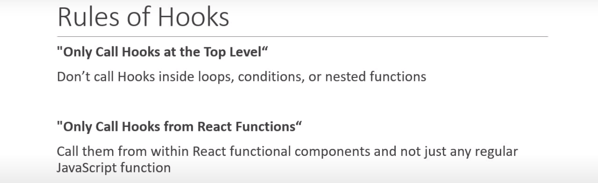

---
